<!-- _class: title -->

Tropical Ruby 2026 Keynote

# AgileVibe Coding

## O que avançou no ecossistema de IA em 2026?

<!--
Restam: ~58:45 (75s)

- Eu quero abrir cravando a tese, porque o resto da palestra existe só pra sustentar isso.
- Sim, IA está substituindo gente em software.
- Mas não do jeito raso que o pânico de internet adora vender.
- O que ela pega primeiro é produtividade fake, senioridade fake e aquela engenharia porca que sobreviveu durante anos porque o mercado aceitava jogar dinheiro fora.
-->
---

<!-- _class: center tone-moss -->
# Fabio Akita

  
<strong style="display:block;font-size:1.3em;margin-bottom:6px;">Codeminer 42</strong>cofundador, hoje no conselho

  
<strong style="display:block;font-size:1.3em;margin-bottom:6px;">RubyConf Brasil</strong>fundador e organizador até 2016

  
<strong style="display:block;font-size:1.3em;margin-bottom:6px;">akitaonrails.com ✦</strong>20 anos em 5 de abril de 2026, 700+ artigos, agora em pt-BR e en

  
<strong style="display:block;font-size:1.3em;margin-bottom:6px;"><svg width="22" height="22" viewBox="0 0 24 24" fill="#c4302b" style="vertical-align:-4px;margin-right:6px;"><path d="M23.498 6.186a3.016 3.016 0 0 0-2.122-2.136C19.505 3.545 12 3.545 12 3.545s-7.505 0-9.377.505A3.017 3.017 0 0 0 .502 6.186C0 8.07 0 12 0 12s0 3.93.502 5.814a3.016 3.016 0 0 0 2.122 2.136c1.871.505 9.376.505 9.376.505s7.505 0 9.377-.505a3.015 3.015 0 0 0 2.122-2.136C24 15.93 24 12 24 12s0-3.93-.502-5.814zM9.546 15.568V8.432L15.818 12l-6.272 3.568z"/></svg>@akitando</strong>500 mil+ seguidores no YouTube

  
<strong style="display:block;font-size:1.3em;margin-bottom:6px;"><svg width="20" height="20" viewBox="0 0 24 24" fill="currentColor" style="vertical-align:-3px;margin-right:6px;"><path d="M18.244 2.25h3.308l-7.227 8.26 8.502 11.24H16.17l-5.214-6.817L4.99 21.75H1.68l7.73-8.835L1.254 2.25H8.08l4.713 6.231zm-1.161 17.52h1.833L7.084 4.126H5.117z"/></svg>@akitaonrails</strong>83,7 mil seguidores no X

  
<strong style="display:block;font-size:1.3em;margin-bottom:6px;">Flow + Inteligência Ltda</strong>alcance além da bolha tech

<!--
Restam: ~57:45 (60s)

- Cards já mostram os números — aproveitar pra mencionar contexto
- RubyConf Brasil: fundei e organizei até 2016
- @akitando: entrevistas do Flow e Inteligência Ltda, alcance fora da bolha tech
- akitaonrails.com: 20 anos no dia 5 de abril de 2026, mesma data do artigo do benchmark — coincidência boa de puxar
- Fecha: "não é currículo, é pra explicar por que eu já vi essa fita antes e não compro hype fácil"
-->
---

<!-- _class: statement -->

Arco Longo

# O pânico da IA caiu em cima de uma bolha velha.

Eu já vinha batendo na economia do programador fake antes de agentes de código prestarem pra alguma coisa.

<!--
Restam: ~56:50 (55s)

- Eu não comecei a falar disso quando IA virou moda.
- Eu já vinha batendo na bolha da programação, na economia do programador ruim, nas promessas de curso e bootcamp, muito antes de agente de código prestar pra alguma coisa.
- A IA não inventou essa fraqueza.
- Ela só escancarou mais rápido.
-->
---

<!-- _class: center tone-ruby -->
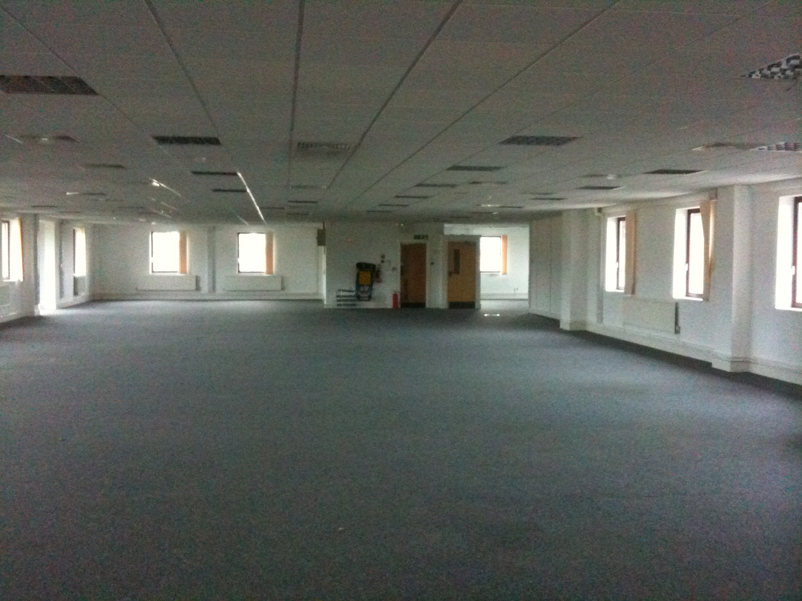

Crunchbase Tech Layoffs Tracker

Fonte: https://commons.wikimedia.org/wiki/File:Empty_office.jpg

# Meio milhão de demitidos em tech desde 2022

  

    
2022

    
93K+

    
a correção começa

  

  

    
2023

    
191K+

    
pico do techlash

  

  

    
2024

    
95K+

    
ritmo segue

  

  

    
2025

    
127K

    
Intel 27K, Microsoft 15K

  

  

    <strong style="font-size:1.05em;">2026 já decolou</strong>
    

      <strong>Oracle:</strong> 20-30K demitidos por e-mail em 31/mar &nbsp;·&nbsp;
      <strong>Meta:</strong> 8K cortados em maio (capex de IA subiu pra $145 bi) &nbsp;·&nbsp;
      <strong>Abril:</strong> 83.387 cortes em tech, 21.490 atribuídos a IA
    

  

Fontes: news.crunchbase.com/startups/tech-layoffs (atualizado 22/abr/26) · techcrunch.com (Oracle, 8/mai/26) · 247wallst.com (Meta, 8/mai/26)

<!--
Restam: ~56:25 (25s)

- ~507K demitidos em tech só nos EUA, 2022-2025 (Crunchbase tracker).
- 2023 foi o pico: 191K. 2025 voltou a subir: 127K, liderado por Intel (27K), Microsoft (15K), Verizon (15K), Amazon (14,7K).
- 2026 já decolou: Oracle 20-30K em 31/mar (por e-mail, severance fraco, RSUs perdidas), Meta 8K em maio.
- Abril/26 sozinho: 83.387 cortes em tech, 21.490 já citando IA explicitamente.
- Meta subiu capex de IA pra $125-145 bi em 2026 — CFO falou em "leaner operating model" pra compensar.
- Crunchbase só conta EUA; total global é maior.
-->
---

<!-- _class: center tone-ruby -->

Akitando, antes da IA virar moda

# Eu Avisei

  

    
    
youtube.com/watch?v=L0hTOY5n9G8

  

  

    
    
youtube.com/watch?v=V7oUDL7E1g4

  

<!--
Restam: ~56:10 (15s)

- Dois vídeos antigos do canal.
- "O que os cursos não te ensinam sobre mercados" e "Rant: programação não é fácil".
- Já estavam batendo na mesma tecla muito antes da IA virar pauta.
-->
---

<!-- _class: center -->

# A mentira antiga

## “vire engenheiro
## de software
## em 2 meses”

  
<strong>Fim de 2022</strong> layoffs vieram antes da IA saber programar direito

  
<strong>ChatGPT</strong> foi acelerador, não causa original

<!--
Restam: ~55:05 (65s)

- A mentira antiga era simples: faz um cursinho rápido, vira engenheiro de software, ganha salário alto e entra no modo easy.
- Isso sempre foi conversa mole.
- Bootcamp ensina ferramenta.
- Não comprime anos de julgamento de engenharia em poucos meses.
-->
---

<!-- _class: center tone-ruby -->

31 de março de 2026

Fonte: https://commons.wikimedia.org/wiki/File:Maid_of_the_Mist_VII_approaching_the_Horseshoe_Falls,_West_view_20170418_1.jpg

# Claude Code vazou

  
<strong>512 mil</strong>linhas de TypeScript

  
<strong>1.900</strong>arquivos

  
<strong>59,8 MB</strong>de mapa do código exposto

  
<strong>6,5/10</strong>o “espaguete de sênior”

<!--
Restam: ~54:10 (55s)

- 31 de março de 2026 — data do leak, poucos dias antes da palestra
- CLI oficial da Anthropic deixou escapar source map: 512k linhas TypeScript, 1.900 arquivos, 59,8MB
- Nota "6.5/10" é a minha avaliação no artigo: espaguete de sênior, não código ruim
- Tom: "confirmação engraçada da tese" — nem a Anthropic escapa de pressão de entrega
-->
---

<!-- _class: center -->

A Faísca

Fonte: https://commons.wikimedia.org/wiki/File:Server_Rack_with_Spaghetti-Like_Mass_of_Network_Cables.jpg

# A lição não foi "uau, magia"

  

    
<strong>Nem a Anthropic escapa</strong> pressão de entrega também gera código tático

    
<strong>E copiaram rápido</strong> free-code e reimplementações apareceram quase na hora

  

  

    
  

<!--
Restam: ~52:40 (90s)

- Abriram o código. O que apareceu? Não foi magia.
- Foi espaguete de sênior: base grande, pressionada por entrega, cheia de remendo.
- E quase imediatamente começaram a reimplementar. Quando a mística some, sobra engenharia.
-->
---

<!-- _class: center tone-sand -->

Fonte: https://commons.wikimedia.org/wiki/File:Slot_machines_at_Monte_Carlo_hotel,_Las_Vegas.jpg

# LLMs são loot boxes

  
<strong>Probabilísticas</strong>
nunca 100% confiáveis

  
<strong>Dependem de contexto</strong>
qualidade depende do que você dá e do que você checa

  
<strong>Gastam loop</strong>
o ecossistema inteiro te incentiva a gastar mais tokens

<!--
Restam: ~51:35 (65s)

- Eu chamei LLMs de loot boxes porque elas são probabilísticas.
- Não são compiladores determinísticos.
- Não existe garantia de correção.
- Dá pra melhorar bastante as chances com contexto, ferramenta, ciclo de avaliação e prompt melhor? Dá.
-->
---

<!-- _class: center tone-sand -->

2026 Ainda

Fonte: https://commons.wikimedia.org/wiki/File:Building_collapse_in_S%C3%A3o_Paulo_2018_090.jpg

# Modelo ainda bajula e erra

  
<strong>Bajula você</strong>
muitas vezes responde o que você quer ouvir

  
<strong>Erra confiante</strong>
inventa detalhe e segue como se estivesse certo

  
<strong>Precisa de freio</strong>
execução, teste e revisão continuam obrigatórios

<!--
Restam: ~50:40 (55s)

- E eu quero deixar uma coisa bem explícita: o modelo de 2026 ainda baixa a cabeça pra você.
- Se você vier com premissa torta, ele muitas vezes prefere te agradar em vez de te contrariar.
- Ele também continua errando com confiança.
- Inventa detalhe, completa lacuna do jeito errado, segue em frente como se estivesse tudo certo.
-->
---

<!-- _class: center tone-moss -->

Linha Do Tempo

Fonte: https://commons.wikimedia.org/wiki/File:Smith_Matrix_mannequins.jpg

# 2025 foi o ano dos Agentes

  
<strong>mar 2025</strong>Responses API, tools e Agents SDK viram produto

  
<strong>mai 2025</strong>Claude 4 pensa entre tool calls e Claude Code vira GA

  
<strong>ago 2025</strong>GPT-5 aguenta loop mais longo e erra menos no uso de ferramenta

  
<strong>nov 2025</strong>GPT-5.1 e Opus 4.5 refinam uso diário

Não foi um dia mágico. Foi o ano inteiro fechando modelo, thinking, tool support e operação.

<!--
Restam: ~49:35 (65s)

- Pra mim, 2025 foi o ano em que a pilha foi fechando.
- Em março, tool support virou plataforma de verdade.
- Em maio, a Anthropic já estava falando de thinking com tool use e colocando Claude Code em circulação séria.
- Em agosto e novembro, os modelos de fronteira ficaram mais estáveis nesse loop.
-->
---

<!-- _class: center tone-moss -->

Convergência

Fonte: https://commons.wikimedia.org/wiki/File:2025_New_Year_Fireworks_in_Tamsui,_New_Taipei_(54238509557).jpg

# Dezembro de 2025 foi a Virada

  
<strong>OpenAI — 13 nov</strong> GPT-5.1 sai pra desenvolvedores e o Codex CLI finalmente fica bom o bastante pra rodar tarefa longa de verdade no terminal

  
<strong>Anthropic — 24 nov</strong> Claude Opus 4.5 sai e o Claude Code amadurece com thinking entre tool calls, execução em background e fluxo de agente sério

Modelo novo + CLI de agente madura, os dois ao mesmo tempo. Em dezembro deu pra apostar tempo de verdade. Em janeiro de 2026 eu entrei nessa também — foi daí que saiu a maratona.

<!--
Restam: ~48:20 (75s)

- Datas marcantes: 13 nov (GPT-5.1 + Codex CLI), 24 nov (Opus 4.5 + Claude Code), 11 dias de distância
- A chave não foi só o modelo novo — foi a CLI de agente amadurecendo junto, nos DOIS lados na mesma janela
- Dezembro 2025: muita gente boa começou a testar pra valer no trabalho real
- Janeiro 2026: foi quando eu entrei na maratona — primeira vez que senti que valia apostar tempo
- Puxa a ponte pro próximo slide: "parei de opinar e fui testar com pele em jogo"
-->
---

<!-- _class: center -->

# Fevereiro a maio de 2026

## eu parei de falar  
## e fui maratonar

Fonte: https://commons.wikimedia.org/wiki/File:Mount_Everest_as_seen_from_Drukair2_PLW_edit.jpg

<!--
Restam: ~47:50 (30s)

- Então eu parei de opinar e fui testar com pele em jogo.
- Não com prompt de brinquedo.
- Não com videozinho fake de SaaS em dez minutos.
- Projeto real.
-->
---

<!-- _class: center tone-sand -->

Painel de Projetos

Fonte: https://commons.wikimedia.org/wiki/File:Potter_shaping_clay_on_a_traditional_manual_potter’s_wheel_in_India_01.jpg

# Do zero pra software real

  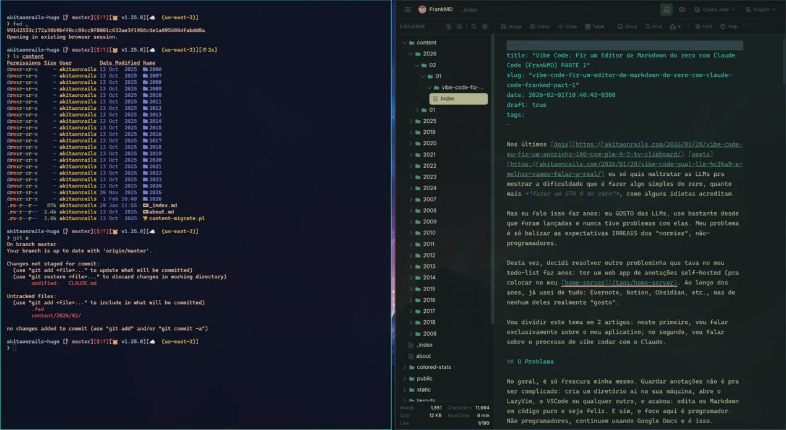
  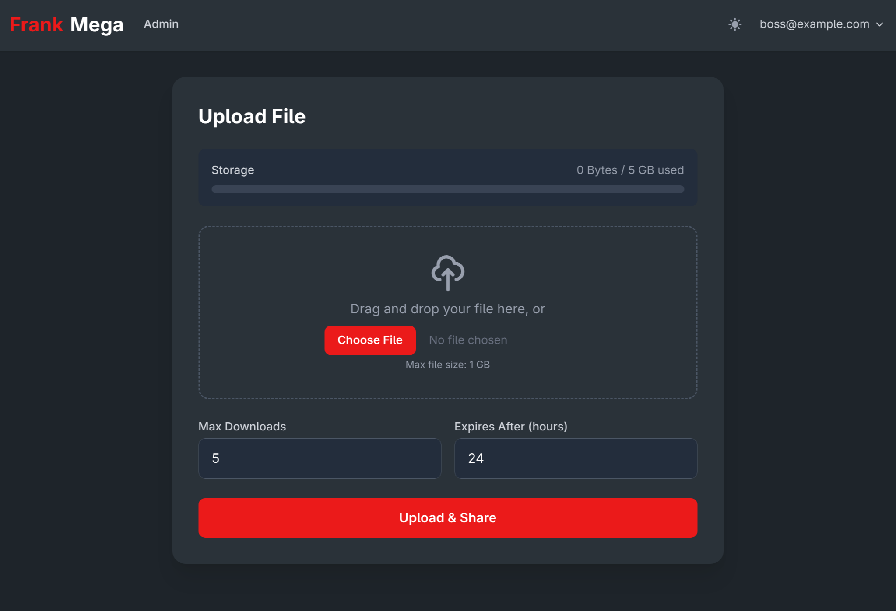
  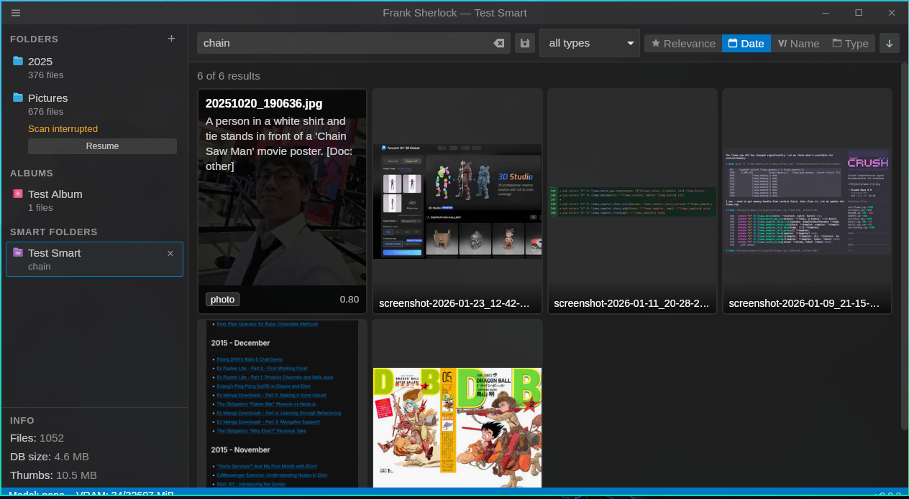
  
  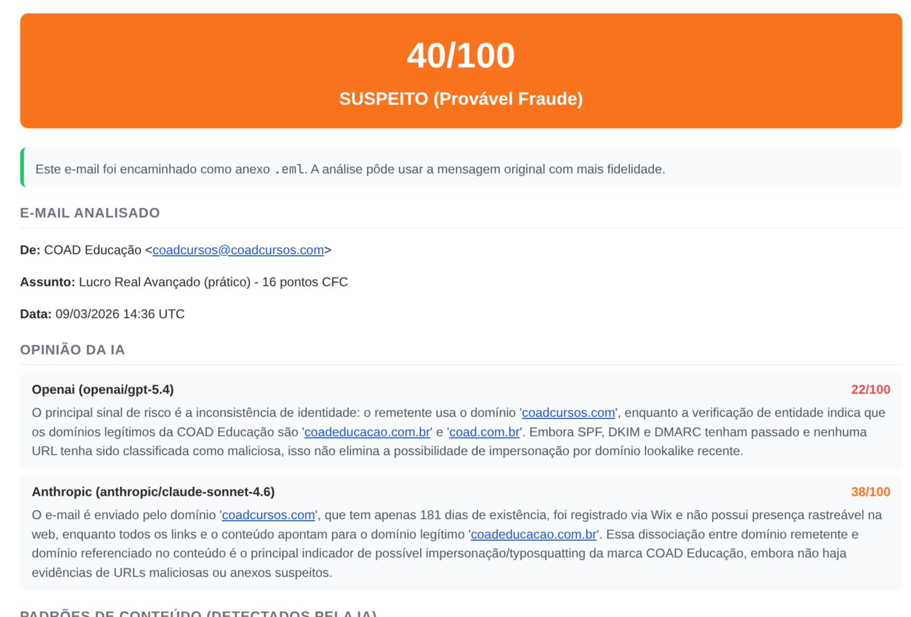
  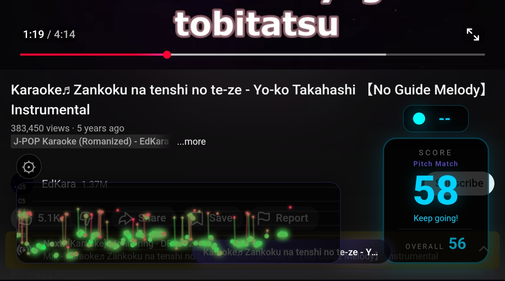
  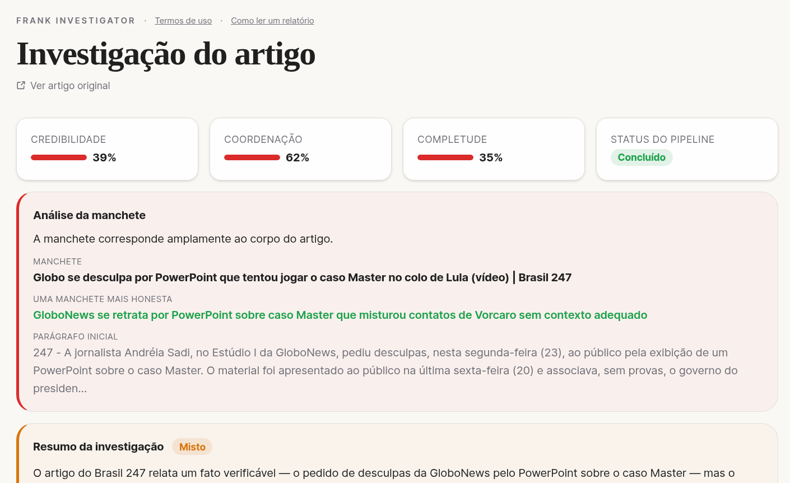
  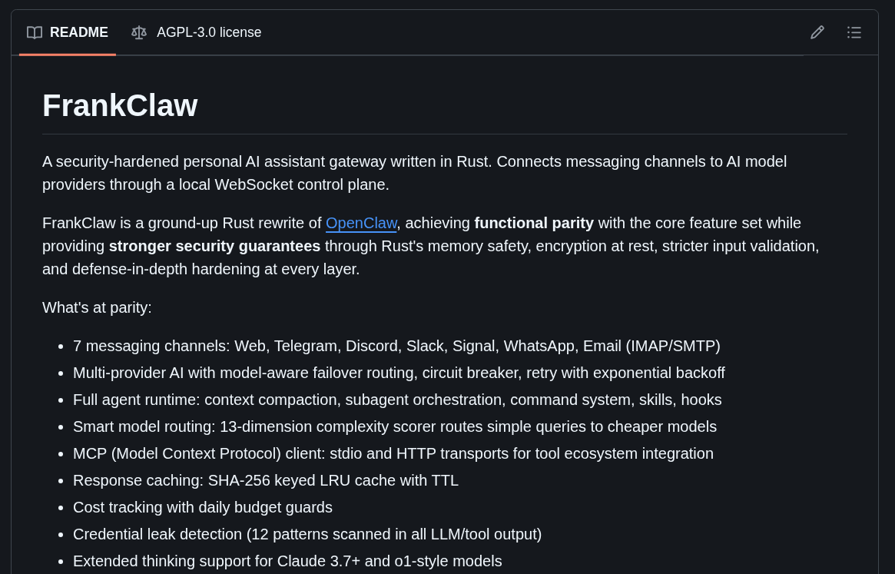

<!--
Restam: ~47:15 (35s)

- Este slide é só a parede de projetos.
- FrankMD, FrankMega, Frank Sherlock, Frank Yomik, Frank FBI, Frank Karaoke e outros.
- O objetivo não é explicar repositório por repositório.
- O objetivo é mostrar volume e variedade: desktop, Rails, Rust, Flutter, ferramentas, mídia, deploy, software em uso real.
-->
---

<!-- _class: center tone-moss -->

Repositórios públicos

# 24 projetos abertos

github.com/akitaonrails — tudo o que rolou na maratona, código aberto.

<!--
Restam: ~47:03 (12s)

- Tudo aberto no GitHub.
- 24 projetos, várias linguagens, vários domínios.
- O que vem a seguir são alguns recortes rápidos.
-->
---

<!-- _class: center tone-sand -->

# ai-jail

  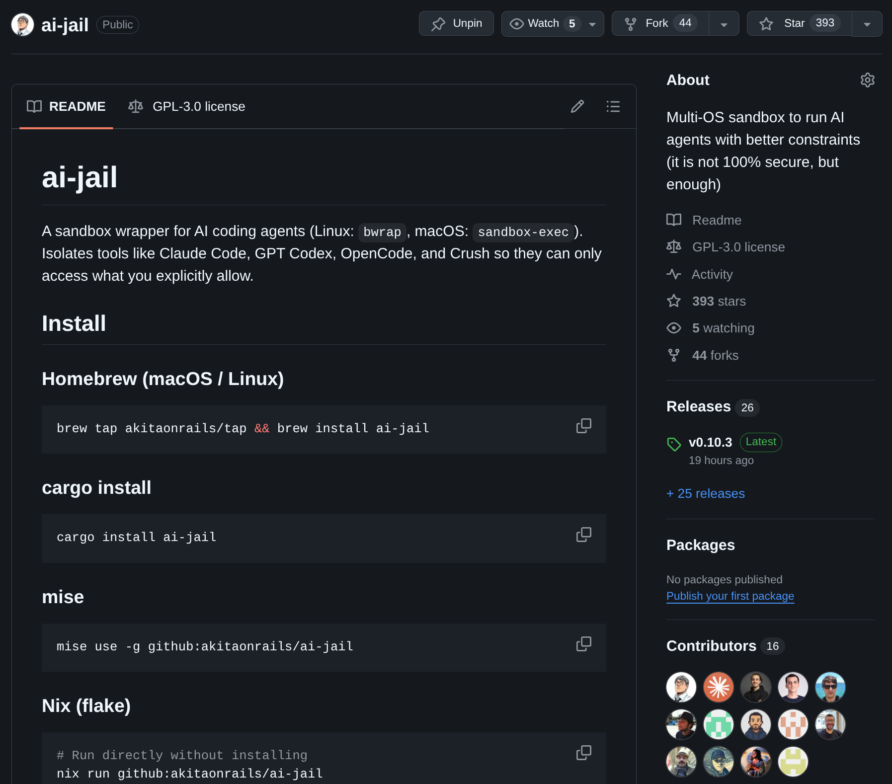

Sandbox multi-OS pra rodar Claude Code, Codex, opencode e Crush sem dar acesso total à máquina. 393 stars, em mise/Homebrew/cargo/Nix.

<!--
Restam: ~46:50 (13s)

- ai-jail: sandbox pra rodar agentes de IA com escopo limitado.
- Linux usa bwrap, macOS usa sandbox-exec.
- Isola os 4 CLIs principais (Claude Code, Codex, opencode, Crush).
- 393 stars, 44 forks, 25+ releases. Instala via mise, brew, cargo ou Nix.
- Surgiu da minha própria necessidade de rodar agente com --yolo sem entregar a chave da casa.
-->
---

<!-- _class: center tone-sand -->

# Frank Investigator

  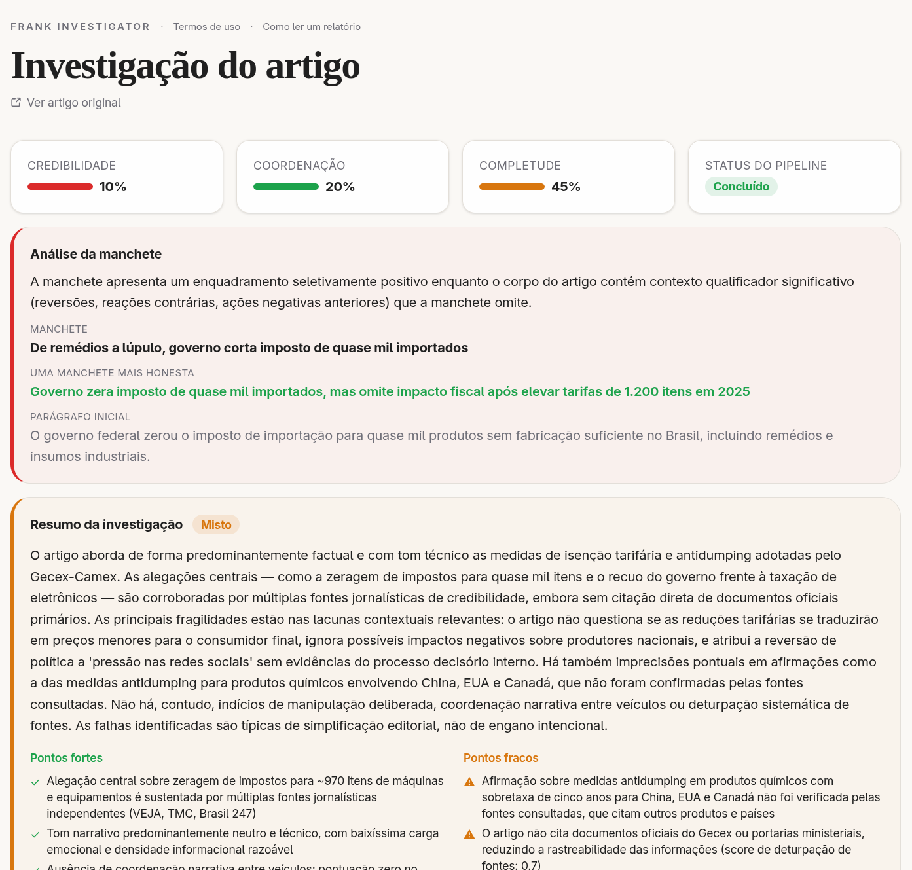

Painel de pesquisa automatizada — agente que cruza fontes e monta dossiê.

<!--
Restam: ~46:40 (10s)

- Frank Investigator.
- Painel para investigação cruzando várias fontes.
- Caso de uso: pesquisa séria sem ficar copiando aba a aba.
-->
---

<!-- _class: center tone-sand -->

# Frank Yomik — Kindle

<!-- pptx-video: frank-yomik-kindle -->

  <video
    src="../assets/flow/kindle.mp4"
    poster="../assets/flow/kindle.jpg"
    autoplay
    muted
    loop
    playsinline
    preload="auto"
    style="max-height:500px;border-radius:18px;box-shadow:0 18px 40px rgba(0,0,0,0.28);background:#000;"
  ></video>

Leitor com tradução em tempo real direto na página do Kindle.

<!--
Restam: ~46:27 (13s)

- Frank Yomik, parte 1.
- Tradução em tempo real para Kindle.
- Mesmo agente que escreveu Frank MD e Sherlock.
-->
---

<!-- _class: center tone-sand -->

# Frank Yomik — Webtoon

<!-- pptx-video: frank-yomik-webtoon -->

  <video
    src="../assets/flow/webtoon.mp4"
    poster="../assets/flow/webtoon.jpg"
    autoplay
    muted
    loop
    playsinline
    preload="auto"
    style="max-height:500px;border-radius:18px;box-shadow:0 18px 40px rgba(0,0,0,0.28);background:#000;"
  ></video>

Mesmo Yomik, agora traduzindo webtoon coreano página por página.

<!--
Restam: ~46:16 (11s)

- Frank Yomik, parte 2.
- Mesmo app, formato diferente: webtoon coreano.
- O agente generalizou o pipeline de tradução pra outro tipo de mídia.
-->
---

<!-- _class: center tone-sand -->

# Frank Karaoke

  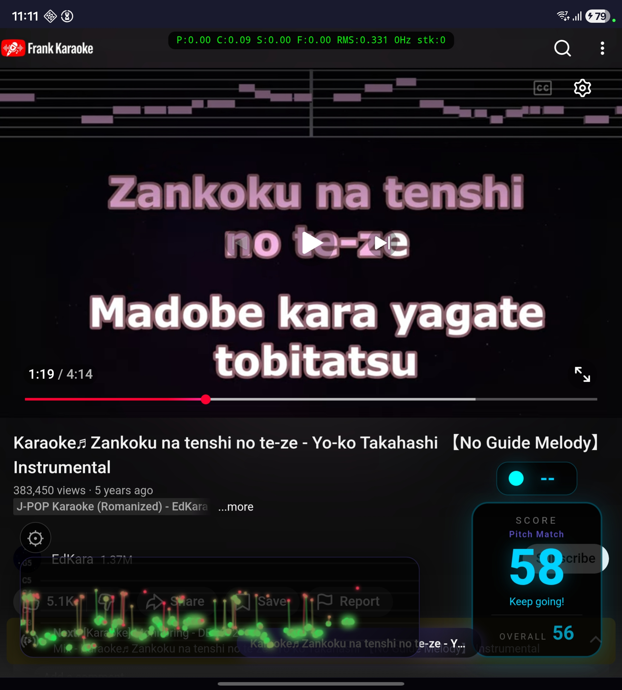

Pipeline de áudio + letra sincronizada para karaoke caseiro.

<!--
Restam: ~46:06 (10s)

- Frank Karaoke.
- Pipeline de áudio: separa vozes, transcreve, sincroniza letra.
- Saída pronta pra karaoke.
-->
---

<!-- _class: center tone-sand -->

# Frank Sherlock

  

Caça nome em redes sociais e monta o rastro de presença online.

<!--
Restam: ~45:56 (10s)

- Frank Sherlock.
- Cruza redes sociais a partir de um handle.
- Útil pra verificar identidade ou levantar contexto.
-->
---

<!-- _class: center tone-sand -->

# Experimento Godot — Super Mario

<!-- pptx-video: godot-mario -->

  <video
    src="../assets/flow/mario.mp4"
    poster="../assets/flow/mario.jpg"
    autoplay
    muted
    loop
    playsinline
    preload="auto"
    style="max-height:500px;border-radius:18px;box-shadow:0 18px 40px rgba(0,0,0,0.28);background:#000;"
  ></video>

Game engine Godot 4 — clone de plataforma estilo Mario, do zero, com agente.

<!--
Restam: ~45:43 (13s)

- Experimento Godot, parte 1.
- Plataforma estilo Mario.
- Tudo escrito pelo agente, eu só dirigi.
-->
---

<!-- _class: center tone-sand -->

# Experimento Godot — Streets of Rage

<!-- pptx-video: godot-streets-of-rage -->

  <video
    src="../assets/flow/streets of rage.mp4"
    poster="../assets/flow/streets of rage.jpg"
    autoplay
    muted
    loop
    playsinline
    preload="auto"
    style="max-height:500px;border-radius:18px;box-shadow:0 18px 40px rgba(0,0,0,0.28);background:#000;"
  ></video>

Mesma engine, gênero diferente — beat 'em up estilo Streets of Rage.

<!--
Restam: ~45:32 (11s)

- Experimento Godot, parte 2.
- Mesma engine, gênero diferente: beat 'em up.
- Mostra que o agente generaliza entre estilos.
-->
---

<!-- _class: center tone-sand -->
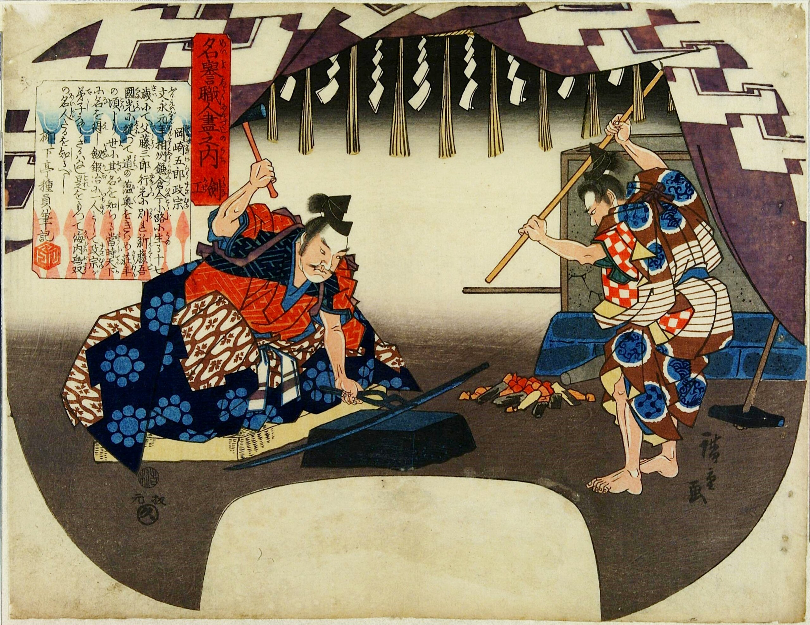

A Prova Prática

Fonte: https://commons.wikimedia.org/wiki/File:Master-Swordsmith-Goro-Masamune-Ukiyo-e.png

# Mesmo dev. Mesmo agente. Processo diferente.

  
<strong>FrankMD</strong> 212 commits em 19 dias, refactor pesado, teste correndo atrás

  
<strong>M.Akita Chronicles</strong> 274 commits em 8 dias, TDD, CI e refatoração contínua

A variável não foi “IA melhor”. Foi disciplina de engenharia desde o primeiro commit.

<!--
Restam: ~44:07 (85s)

- Aqui entra a comparação que eu acho mais forte de todas.
- FrankMD de um lado.
- M.Akita Chronicles do outro.
- Mesmo desenvolvedor.
- Aqui deixa de ser opinião e vira evidência.
-->
---

<!-- _class: center tone-sand -->

Recorte TotalPass 2026

Fonte: https://commons.wikimedia.org/wiki/File:African_Bull_elephant_walking_towards_camera_in_August_2013.jpg

# Números que pesam

  
<strong>391.796</strong>linhas úteis

  
<strong>58.967</strong>linhas de teste

  
<strong>2.029</strong>commits

  
<strong>~429 h</strong>horas ativas estimadas

Agregado de 24 projetos AI-assisted: `tokei` sem linhas em branco, contando código + comentários + markdown/conteúdo rastreado. `shadPS4` só na branch `gamma-debug`; `akitaonrails-hugo` só no recorte AI-era. Testes separados por path. Fora: assets, vendor, build, fixtures, snapshots e árvore de terceiros.

<!--
Restam: ~42:32 (95s)

- Ferramenta: `bin/totalpass-metrics`, usando `tokei`
- Critério: linhas úteis rastreadas em git; teste por path; sem branco/assets/vendor/build
- Exceções: `shadPS4` só `gamma-debug`; site só recorte AI-era
- Horas: sessões agrupadas por commit, 90min de corte, +20min por sessão, 8h de teto
- Antecipa crítica: "~429h não é tudo que eu trabalhei" — é só o rastreável por commit
- Fecha: "agora dá pra discutir mecanismo, não fé"
-->
---

<!-- _class: center tone-sand -->

Normalizando o Ritmo

Fonte: https://commons.wikimedia.org/wiki/File:Berlin-Marathon_2015_Runners_14.jpg

# 3 meses de maratona não são 3 meses normais

  
<strong>~90 dias corridos</strong>quase 16h por dia, 7 dias por semana

  
<strong>~252 dias corridos</strong>algo perto de 8 meses e 1 semana

  
<strong>~1.260 a 2.520 dias corridos</strong>o mesmo sênior sem IA

  
<strong>~42 a 84 meses</strong>ou cerca de 3,5 a 7 anos

Estimativa linear em calendário real de trabalho: 8h por dia, só em dias úteis.

<!--
Restam: ~41:07 (85s)

- Não é truque de palco — ritmo real foi ~16h/dia, 7 dias/semana por ~90 dias corridos (fev, mar, abr)
- Conversão pra ritmo sustentável de sênior (8h/dia, só dias úteis) → ~252 dias = ~8 meses e 1 semana
- Em cima disso, aplicar o 5-10x sem IA → ~1.260 a 2.520 dias corridos = ~42 a 84 meses = 3,5 a 7 anos
- Disclaimer: conta linear, ordem de grandeza, não previsão exata
- Mensagem: não é 3 meses contra 3 meses, é 3 meses de maratona contra anos de desenvolvimento normal
-->
---

<!-- _class: center tone-sand -->

Fonte: https://commons.wikimedia.org/wiki/File:Basra_bodybuilding_competition_DVIDS288972.jpg

# Alcançamos "Developer 10x"?

  
<strong>5x a 10x</strong>de velocidade

  
<strong>Mais tração</strong>menos bloqueio, menos procrastinação

  
<strong>Mais alcance</strong>stack inteira, ferramentas, deploy, documentação

  
<strong>Mais confiança</strong>testes, integração contínua, refatoração, produção

<!--
Restam: ~39:37 (90s)

- Da minha experiência prática, o resumo honesto é 5x a 10x de velocidade.
- Não porque o modelo escreve código perfeito.
- Não escreve.
- O ganho vem porque ele atravessa aquele atrito chato que normalmente quebra foco: código repetitivo, busca, refatoração repetitiva, teste repetitivo, execução de comando, tentativa rápida.
-->
---

<!-- _class: center tone-moss -->
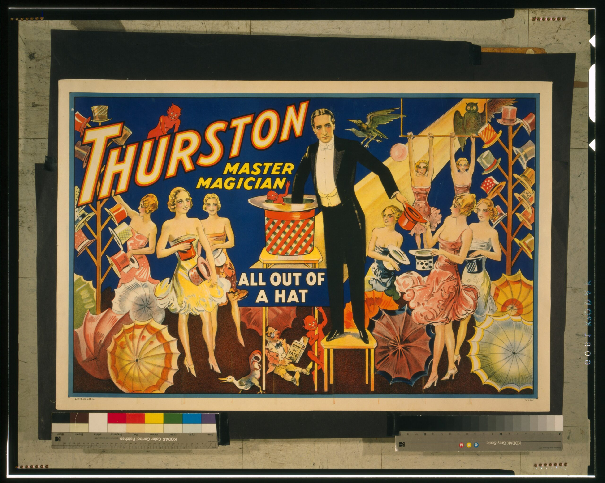

Fonte: https://commons.wikimedia.org/wiki/File:Thurston,_master_magician_all_out_of_a_hat._LCCN2014636958.jpg

# Prompt único é pra demo

  
<strong>Produção é iteração</strong> bug, deploy, retorno, refatoração, ajuste de prompt

  
<strong>“Pronto” é mentira</strong> 125 commits de pós-produção em 4 projetos

<!--
Restam: ~38:32 (65s)

- A fantasia do prompt único é preguiçosa.
- Ela parte da ideia de que dá pra prever e especificar tudo antes.
- Software real não funciona assim.
- Produção revela coisa que você nem sabia que importava.
-->
---

<!-- _class: center -->

Akita Antigo Continua Certo

Fonte: https://commons.wikimedia.org/wiki/File:Rebar_installation_in_the_Pier_Foundation_(rubin-20160209-110033).jpg

# Fundamento primeiro

  
  
  
  

<!--
Restam: ~37:32 (60s)

- É por isso que o Akita antigo continua valendo.
- Não terceirize sua decisão.
- Aprenda a aprender.
- Entenda que programação não é fácil.
-->
---

<!-- _class: center -->

# Não terceirize seu julgamento

## nem pra guru  
## nem pra bootcamp  
## nem pro modelo

A lógica continua a mesma: experimento pequeno, feedback rápido, correção contínua.

<!--
Restam: ~36:37 (55s)

- O mais difícil de ensinar pra iniciante é isso: julgamento não é uma coisa que você baixa pronta.
- Não vem de influencer, não vem de bootcamp, não vem de modelo.
- O modelo mental continua o mesmo: experimento pequeno na beira do caos, erro cedo, retorno rápido, correção contínua.
-->
---

<!-- _class: center tone-moss -->
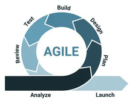

Nome Verdadeiro

# Agile Vibe Coding

## é XP com pareamento de máquina

  
<strong>TDD</strong>
segura erro de modelo antes de virar lama

  
<strong>CI por commit</strong>
pega drift e regressão cedo

  
<strong>Refatoração contínua</strong>
evita cirurgia cara depois

<!--
Restam: ~35:07 (90s)

- Agile Vibe Coding é XP com pareamento de máquina. A estrutura por baixo é velha.
- TDD não é perfumaria. Segura erro de modelo antes de virar lama.
- CI por commit pega drift e regressão cedo.
- Refatoração contínua evita cirurgia cara depois.
-->
---

<!-- _class: center tone-moss -->
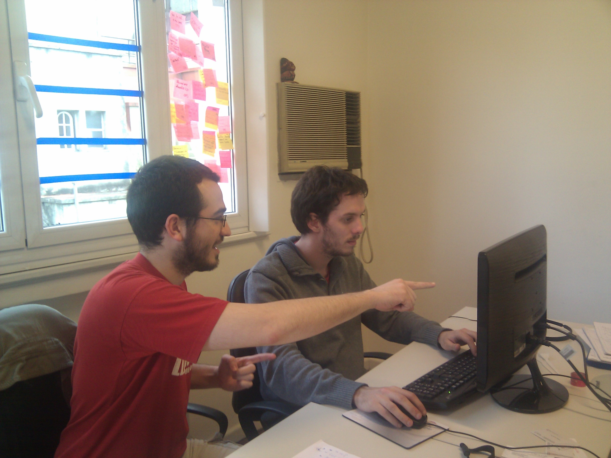

Fonte: https://commons.wikimedia.org/wiki/File:Pair_Programming.jpg

# O pareamento mudou

  
<strong>Eu trago</strong> direção, julgamento, contexto, gosto

  
<strong>O agente traz</strong> velocidade de execução, busca, fôlego operacional

IA é espelho: sênior bom ganha alavancagem, programador ruim ganha velocidade pra errar.

<!--
Restam: ~33:37 (90s)

- O melhor corte de responsabilidade que eu encontrei foi esse: eu trago direção, julgamento, contexto e gosto.
- O agente traz velocidade de execução, busca e fôlego operacional.
- Se eu reduzo o agente a digitador burro, piora.
- Se eu entrego produto e arquitetura pra ele sozinho, piora também.
-->
---

<!-- _class: center tone-sand -->

Código e dados públicos

# github.com/akitaonrails/ llm-coding-benchmark

  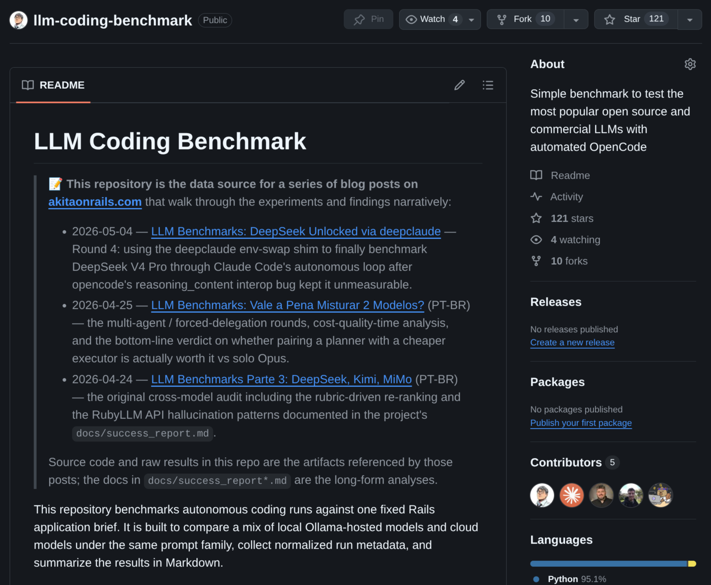

<!--
Restam: ~33:25 (12s)

- O repositório que sustenta todo o argumento que vem a seguir.
- 4 rodadas documentadas: 5/abr (original), 18/abr (multi-modelo), 24/abr (canonical), 25/abr (orquestração), 4/mai (DeepSeek via DeepClaude).
- 121 stars, infra em OpenCode, prompt e config versionados.
- Quem quiser reproduzir, está tudo lá.
-->
---

<!-- _class: center tone-sand -->

Resultado Consolidado

# Benchmark Ranking (Maio/2026)

  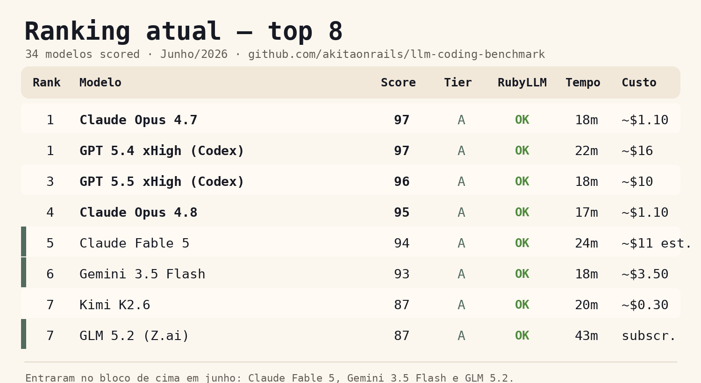

<!--
Restam: ~33:13 (12s)

- 24 modelos, score 0-100, Tier A/B/C/D.
- Topo: Opus 4.7 e GPT 5.4 xHigh empatam em 97. GPT 5.5 em 96 (40% mais barato). DeepSeek V4 Pro (DeepClaude) em 89. Kimi K2.6 em 87.
- Tier A custo extremo: $0.30 (Kimi) → $16 (GPT 5.4).
- Tier B e abaixo: Sonnet, DeepSeek V4 Flash, Grok 4.3, Qwen, MiMo, GLM.
- Tier D (lixo): Grok 4.20, GPT OSS 20B local.
-->
---

<!-- _class: center tone-moss -->

Estado dos Modelos, abril de 2026

Fonte: https://commons.wikimedia.org/wiki/File:The_Prime_Minister_meets_with_AI_developers.jpg

# Modelos fechados ainda lideram

  
<strong>Anthropic</strong>
Opus 4.6/4.7 e Sonnet 4.6 ainda no topo pra código sério

  
<strong>OpenAI</strong>
GPT 5.4 e 5.5 via Codex empatam com Opus em qualidade

  
<strong>China entrou no Tier A</strong>
Kimi K2.6 e DeepSeek V4 Pro chegaram em abril/26

A virada da última rodada do benchmark: chineses entraram no Tier A, GLM caiu de tier. Open source ainda não substitui o fluxo completo com agentes — mas o gap encurtou.

<!--
Restam: ~32:08 (65s)

- Em abril de 2026, leitura prática: Anthropic e OpenAI continuam no topo pra código sério.
- Anthropic: Opus 4.6 ainda é meu padrão diário, 4.7 está no topo do benchmark objetivo (97/100).
- OpenAI: GPT 5.4 e 5.5 via Codex empatam com Opus (97 e 96/100). 5.5 é 40% mais barato.
- Surpresa da última rodada: chineses entraram no Tier A — Kimi K2.6 e DeepSeek V4 Pro.
- GLM 5.1 caiu pra Tier C: DSL inventada e history descartada por turno.
- Open source tem utilidade, mas ainda não empata no fluxo completo com agentes.
-->
---

<!-- _class: center tone-moss -->
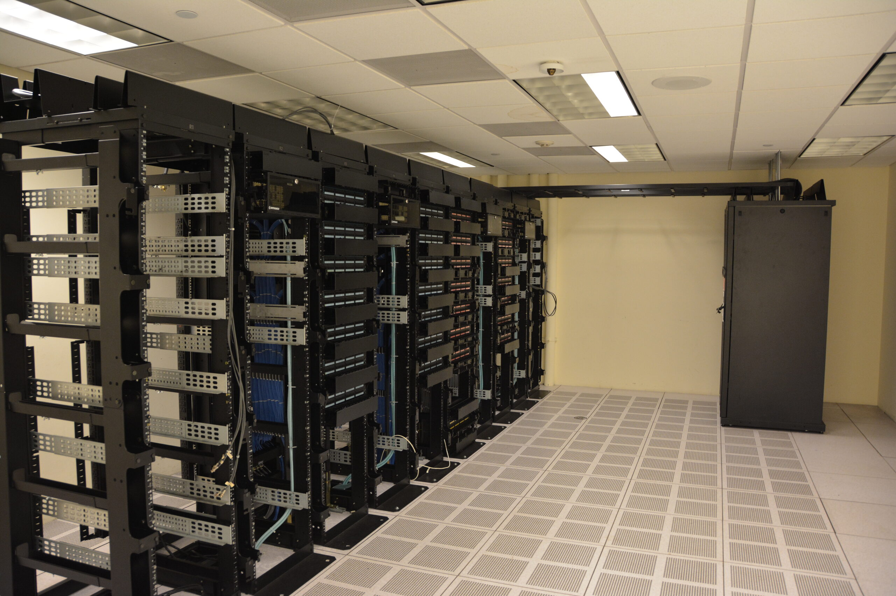

Benchmark Próprio — 22 Modelos, Código Real

Fonte: https://commons.wikimedia.org/wiki/File:Datacenter_Server_Racks_(22370909788).jpg

# Quem consegue bater o Claude Opus?

  

    
<strong>7 modelos no Tier A em abril/26</strong> Opus 4.7 e GPT 5.4 empatam no topo (97/100). GPT 5.5 (96), DeepSeek V4 Pro via DeepClaude (89), Kimi K2.6 (87), Opus 4.6 (83), Gemini 3.1 Pro (82)

    
<strong>Chineses fecharam o gap</strong> Kimi K2.6 e Gemini 3.1 Pro entregam Tier A. GLM 5.1 ficou em Tier C com DSL inventada e history descartada por turno.

    
<strong>Thinking + tool calling + cache</strong> tamanho virou commodity. O que separa Tier A das outras é infraestrutura, não parâmetros — sem isso, o modelo chuta

  

  

    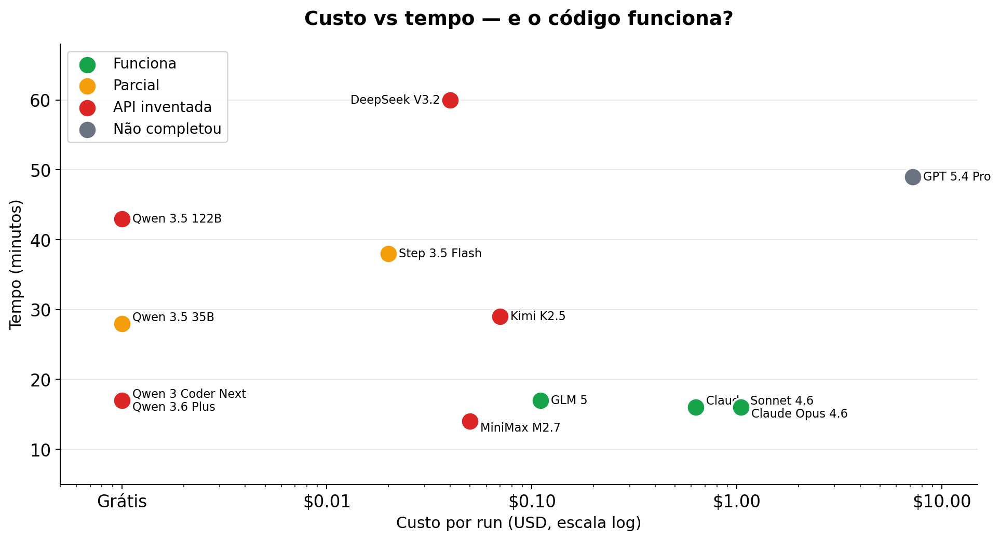
  

Artigos: akitaonrails.com — benchmark canonical 24/abr/26 + DeepClaude unlock 4/mai/26

<!--
Restam: ~30:33 (95s)

- Benchmark: 24 modelos, mesmo runner, mesmo task (app Rails com RubyLLM).
- Rubrica em 8 dimensões: completude, RubyLLM, testes, error handling, persistência, Hotwire, arquitetura, prod-ready. Score 0-100, Tier A/B/C/D.
- Top: Opus 4.7 e GPT 5.4 xHigh empatam em 97/100. GPT 5.5 lança 40% mais barato pelo mesmo resultado (96/100).
- DeepSeek V4 Pro destrava com DeepClaude (shim pro Claude Code) e cai pra Tier A em 89/100.
- Kimi K2.6 é o Tier A mais barato do benchmark — $0.30/run, 3-50x mais barato que Opus/GPT.
- Kimi K2.6 e Gemini 3.1 Pro entregam Tier A; GLM 5.1 ficou em Tier C (DSL inventada + history descartada por turno).
- Mensagem central: tamanho virou commodity, infraestrutura é o que separa os tiers.
-->
---

<!-- _class: center tone-moss -->

Por Que Tão Poucos Funcionam

Fonte: https://commons.wikimedia.org/wiki/File:The_Thinker_detail_of_the_Gates_of_Hell_Rodin_musée_Rodin_S.01304_Paris.jpg

# Não é mais só parâmetros

  
<strong>Prompt Caching</strong>
sem cache de KV, cada turno relê o contexto inteiro e o custo explode no loop do agente

  
<strong>Tool Calling</strong>
o modelo precisa decidir qual ferramenta chamar, com quais argumentos, e tratar o resultado de volta

  
<strong>Reasoning / Thinking</strong>
budget extra de inferência pra planejar antes de agir, em vez de chutar a primeira coisa

Tamanho de modelo virou commodity. As três condições acima é que separam quem aguenta um agente real — DeepSeek, por exemplo, falha hoje justamente por não fechar essas três.

<!--
Restam: ~29:08 (85s)

- Gancho: "por que só 4 modelos passaram no benchmark?"
- Tamanho virou commodity — não é parâmetro, é infraestrutura
- Prompt caching → KV cache; sem isso sessão longa do Claude Code explode em custo
- Tool calling → open source frequentemente trava ou inventa método
- Thinking / reasoning → Anthropic chama de "thinking", é budget extra de inferência
- Exemplo pra cravar: DeepSeek — modelo ok, falha por não fechar os 3
- Puxar pro próximo slide: "Coder" no nome falha pelos mesmos motivos
-->
---

<!-- _class: center tone-moss -->

Surpresa Da Família Qwen

Fonte: https://commons.wikimedia.org/wiki/File:Ancient_Chinese_Writing_on_Warring_States_Bamboo_Slips_1.jpg

# "Coder" no nome não vira coder melhor

  

    
<strong style="font-size:1.1em;">Qwen 3 Coder 30B</strong>
devolveu string mockada hardcoded em vez de chamar a API

    
<strong style="font-size:1.1em;">Qwen 2.5 Coder 32B</strong>
90 minutos de timeout, zero arquivos escritos

  

  

    
<strong style="font-size:1.1em;">Qwen 3.5 27B distilado do Claude 4.6</strong>
"Claude em casa" rodou Rails mas alucinou a API toda

    
<strong style="font-size:1.1em;">Qwen 3.5 35B-A3B (MoE geral) ✓</strong>
único que vale a tentativa: rodou Rails e alucinações somem em 1-2 follow-ups — ainda assim atrás de Claude, GPT 5.4 e GLM 5.1

  

<!--
Restam: ~27:48 (80s)

- Gancho: "intuição era que 'Coder' no nome seria melhor — deu o contrário"
- 3 Qwen Coder testados, 2 falharam catastroficamente, 1 nem rodou
- Detalhe marcante: 3 Coder 30B devolveu string MOCKADA HARDCODED em vez de chamar API
- 2.5 Coder 32B → 90 min de timeout, zero arquivos
- Versões gerais bateram Coder dedicadas → fine-tuning em código ≠ fluxo de agente
- Distilado do Claude (3.5 27B) era a aposta "Claude em casa" → rodou Rails mas alucinou API toda
- Qwen do card verde = 3.5 35B-A3B (MoE geral), 5090, 1-2 follow-ups arrumam, o "menos ruim"
- Quwen = Qianwen = "mil perguntas" em mandarim (se quiser soltar a curiosidade sobre o nome)
- Amarrar: mesmas 3 condições do slide anterior — label não substitui infraestrutura
-->
---

<!-- _class: center tone-moss -->

Aceitando A Imperfeição

Fonte: https://commons.wikimedia.org/wiki/File:Kintsugi.jpg

# IA nunca vai ser perfeita.

## Mas errar ficou barato.

  
<strong>claw-code: clean-room em 24h</strong>
clone do Claude Code reimplementado do zero logo depois do leak

  
<strong>free-code: fork sem amarras</strong>
telemetria e travas arrancadas quase na hora

  
<strong>OpenClaw + memclaw</strong>
base madura, já com memclaw plugado — sistema de memória inspirado no do Claude

<strong>Barato:</strong> CRUD, landing page, painel interno, bot, ETL, cola entre APIs. &nbsp;|&nbsp; <strong>Caro continua o que sempre foi:</strong> julgamento, arquitetura, operação, dono do problema.

<!--
Restam: ~26:18 (90s)

- Ponto conceitual: não é que modelo ficou perfeito, é que errar ficou BARATO
- Chave da virada: ciclo de feedback curto → stack trace → conserto → retry em segundos
- claw-code → clone clean-room, github.com/ultraworkers/claw-code, <24h depois do leak
- free-code → fork sem telemetria, sem travas
- OpenClaw + memclaw → memclaw é sistema de memória inspirado no do Claude, github.com/Felo-Inc/memclaw
- Mensagem: open source absorveu comportamento E padrões internos, muito rápido
- Corte de mercado → barato: CRUD, landing, bot, ETL, cola entre API
- Caro continua igual: julgamento, arquitetura, operação, dono do problema
- Background: kintsugi — cerâmica quebrada consertada com ouro, o "defeito vira feature"
-->
---

<!-- _class: center tone-sand -->

Assinatura Vs Token

Fonte: https://commons.wikimedia.org/wiki/File:ATM_PIN_buttons_20180827.jpg

# Assinatura ganha de pay-as-you-go

  

    
<strong>GPT 5.4 / 5.5 Pro na API</strong>
~$990/mês via token. GPT 5.5 corta 40% mantendo a qualidade.

    
<strong>ChatGPT Pro</strong>
$200/mês ilimitado — 5x mais barato que a API. Codex já entrou na cota.

    
<strong>Claude Opus 4.6/4.7 na API</strong>
~$450/mês via token. Por run: ~$1.10.

    
<strong>Tier A chinês</strong>
Kimi K2.6 $0.30/run, DeepSeek V4 Pro (DeepClaude) $3.14/run

  

  

    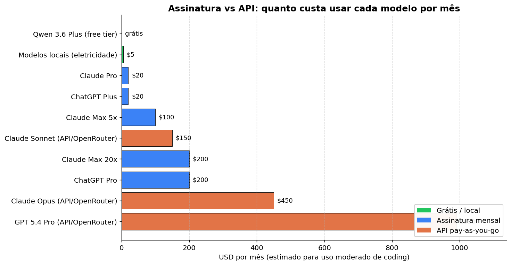
  

Estimativa pra uso moderado de coding (~15M input + ~3M output tokens/mês).

<!--
Restam: ~24:53 (85s)

- Suposição do benchmark: ~15M tokens input + ~3M output por mês (uso moderado de coding)
- GPT 5.4 Pro via API: $180/M output tokens — vira os ~$990/mês
- GPT 5.5 (abril/26): mesma qualidade do 5.4, 40% mais barato em tokens. ~$10/run vs $16/run.
- Claude Opus 4.6/4.7 via API: ~$25/M output tokens → ~$450/mês ou ~$1.10/run
- ChatGPT Pro $200 = ilimitado, e Codex agora consome da mesma cota — 5x mais barato que API
- Claude Max 20x $200 → ~220K tokens a cada 5h, ~metade do preço do Opus na API
- Tier A chinês entrou na conta: Kimi K2.6 $0.30/run, DeepSeek V4 Pro via DeepClaude $3.14/run
- Disclaimer honesto: provavelmente subsidiado, pode não durar pra sempre
- Contexto: Anthropic preparando IPO em 2026 pressiona essa margem (puxa pro slide seguinte)
-->
---

<!-- _class: center tone-moss -->

Chineses no Tier A

# China chegou perto do topo

  

    <strong style="font-size:1.15em;">Kimi K2.6 (Moonshot)</strong>
    

      <strong>87/100 Tier A</strong> — único Tier A não-ocidental por mérito direto. 
      $0.30/run, 20 min. <strong>Tier A mais barato</strong> do benchmark (3 a 50x mais barato que Opus/GPT). 
      FakeChat com signature correta, rescue de erro, session cookie multi-worker safe.
    

  

  

    <strong style="font-size:1.15em;">DeepSeek V4 Pro</strong>
    

      <strong>89/100 Tier A</strong> — destrava só com <strong>DeepClaude</strong> (shim que troca o endpoint do Claude Code). 
      $3.14/run, 18 min. No opencode fica em limbo: protocolo de thinking incompatível com ai-sdk. 
      Modelo era capaz; faltava harness que falasse o protocolo dele.
    

  

GLM 5.1 caiu pra Tier C (DSL inventada). MiMo V2.5 Pro caiu pra Tier B. O gap fechou em qualidade, não em variedade — só Kimi e DeepSeek bem orquestrados aguentam Tier A hoje.

<!--
Restam: ~24:28 (25s)

- Recorte importante da última rodada do benchmark: pela primeira vez, chineses chegaram no Tier A.
- Kimi K2.6 (Moonshot): 87/100, $0.30/run, Tier A mais barato do benchmark.
- DeepSeek V4 Pro: 89/100 SÓ via DeepClaude — shim que troca o endpoint do Claude Code pra OpenRouter.
- No opencode, V4 Pro travava no protocolo de thinking (reasoning_content stripping no ai-sdk).
- Era harness, não modelo. Trocou o harness, foi pra Tier A.
- GLM 5.1 ficou em Tier C, MiMo em Tier B — só Kimi e DeepSeek bem orquestrados aguentam Tier A hoje.
- Mensagem: gap fechou em qualidade, não em variedade — preço caiu, mas é só Kimi e DeepSeek bem orquestrados.
-->
---

<!-- _class: center tone-sand -->

Economia da IA

# Treino e inferência disputam a mesma tomada

  
<strong>US$ 500 bi</strong>
investimento global em data centers em 2024

  
<strong>415 → 945 TWh</strong>
consumo elétrico dos data centers de 2024 até 2030

  
<strong>20%</strong>
dos projetos podem atrasar por gargalo de rede

  
<strong>2,5 bi/ano</strong>
ritmo anual do Claude Code, com uso semanal dobrando desde 1 jan 2026

Meu palpite: com energia, margem e demanda apertando, eu esperaria menos milagre de treino e mais briga por eficiência, suporte a ferramentas e inferência.

<!--
Restam: ~23:03 (85s)

- Aqui entra minha especulação.
- A conta física começou a apertar.
- Data center consome mais energia, investimento explodiu e já tem projeto atrasando por gargalo de rede.
- Ao mesmo tempo, agente bom gasta mais inferência por usuário do que chatbot bobo.
- Então eu não espero salto de ordem de grandeza tão cedo.
- Eu espero mais trabalho em eficiência, serving, tool support e produto.
- E se a Anthropic vier mesmo para IPO este ano, a pressão por margem e previsibilidade aumenta mais ainda.
-->
---

<!-- _class: center tone-ruby -->

A Conta Física Apertou

# 7 GW que não saem do papel em 2026

  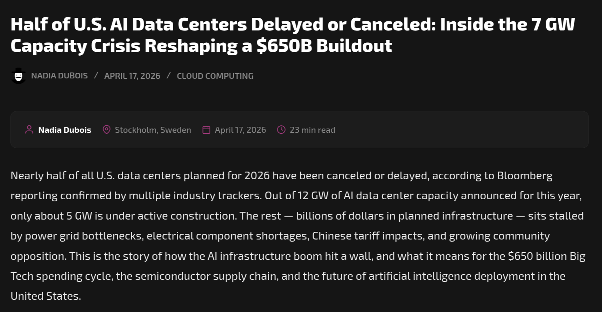

Fonte: tech-insider.org/us-ai-data-center-delays-cancellations-7gw-capacity-crisis-2026 (Bloomberg + Sightline Climate + US ITC, abril/maio 2026)

<!--
Restam: ~22:43 (20s)

- Anunciado pra 2026: ~12 GW. Em obra de verdade: ~5 GW. Buraco: 7 GW.
- ~Metade dos data centers de 2026 atrasou ou foi cancelado (Bloomberg confirma 30-50%).
- Equivale a 30-70 campi de IA não entregues, ~$1-4 bi cada em capex.
- Gargalo físico: transformador de alta tensão com fila de até 5 anos (US ITC); switchgear, baterias e tarifa chinesa de 15-25% em cima.
- Fila de conexão à rede: até 5 anos pra ligar 1 data center novo na rede.
- Pipeline pior em 2027 (21,5 GW anunciado, só 6,3 GW em obra) e 2028-2032 (37 GW anunciado, só 4,5 GW).
- Mas o capex dos hyperscalers NÃO recuou: $650 bi em 2025-2026 (Alphabet, Amazon, Meta, Microsoft) — dinheiro tem, falta megawatt.
- OpenAI Stargate ($500 bi) em Abilene, Texas: zero progresso físico relevante até abril/26.
- Mensagem: dólar sobra, tomada não. É a contradição que ancora o slide seguinte.
-->
---

<!-- _class: center tone-sand -->

Mercado de Compute

# A corrida por compute acelera em 2026

  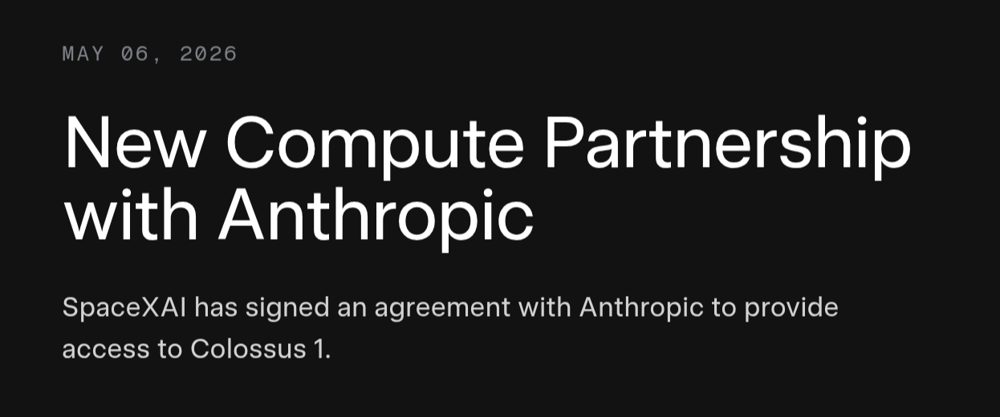

<!--
Restam: ~22:28 (15s)

- Mesmo com a correção em curso, a corrida por compute não desacelera.
- Anthropic e xAI assinando contratos gigantes de capacidade pra 2026.
- O dinheiro de infraestrutura segue subindo: a fila não é por talento júnior, é por GPU e energia.
-->
---

<!-- _class: center tone-sand -->

Recomendação Prática

# As Únicas Ferramentas pra Usar Agora

  

    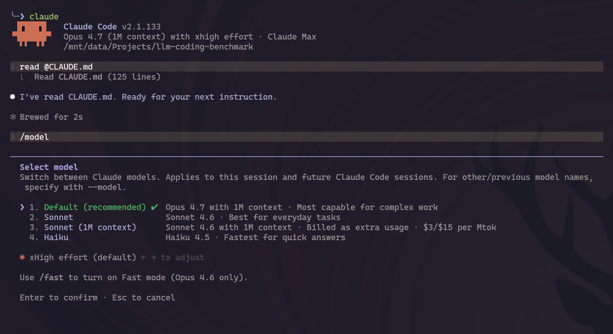
    
<strong>Claude Code</strong>

  

  

    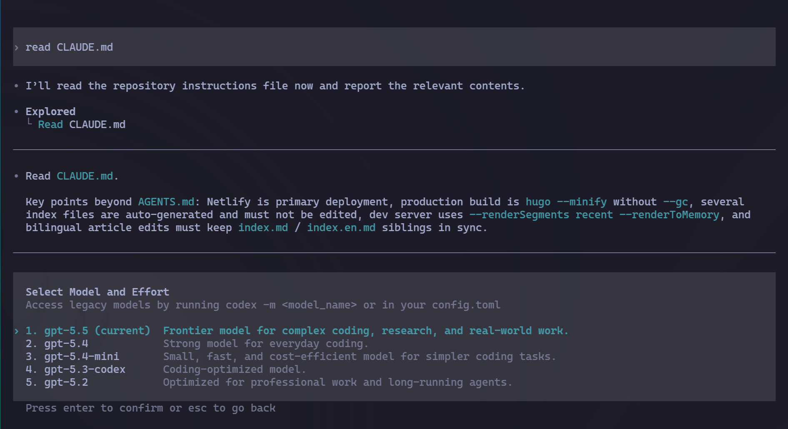
    
<strong>Codex</strong>

  

  

    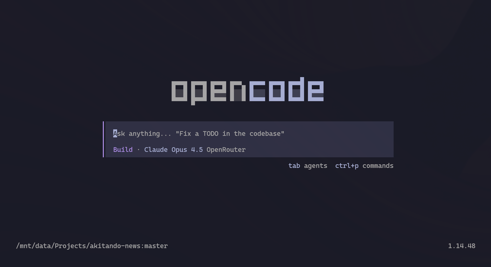
    
<strong>opencode</strong>

  

  

    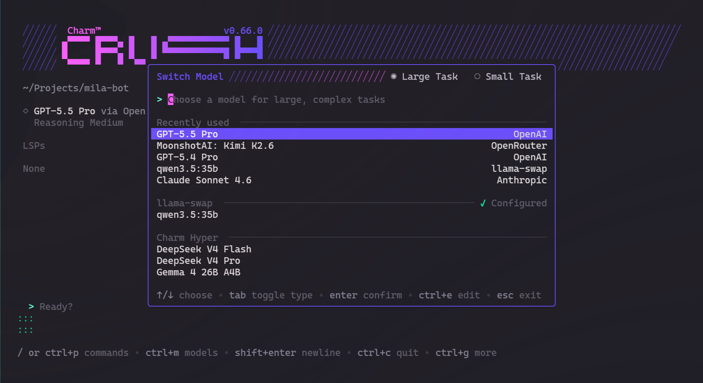
    
<strong>Crush</strong>

  

<!--
Restam: ~22:08 (20s)

- Em meio à confusão de modelos e benchmark, esses são os 4 CLI de agente que aguentam trabalho sério hoje.
- Claude Code (Anthropic, padrão diário) e Codex (OpenAI, equivalente em qualidade).
- opencode e Crush: agnósticos a modelo, úteis pra Tier A chinês e benchmarks neutros.
- Resto (Aider, Cursor, Cline, Windsurf, etc.) tem espaço, mas esses 4 cobrem o caso de uso de agente terminal sério.
-->
---

<!-- _class: center tone-ruby -->

A Correção

Fonte: https://commons.wikimedia.org/wiki/File:Employee_Packing_Things_Into_Box.jpg

# Programador ruim vai sair

## e isso melhora a indústria

E a correção continua agora. Em 1 de abril de 2026, a Oracle entrou em mais uma rodada grande de layoffs.

<!--
Restam: ~21:08 (60s)

- Aqui é a parte em que eu paro de fingir diplomacia.
- Eu estou genuinamente feliz que a bolha do programador ruim esteja morrendo.
- A indústria passou anos trocando engenharia por competência fake e dívida técnica.
- A correção continua: Oracle reportou mais uma onda pesada de layoffs em 1 de abril de 2026.
-->
---

<!-- _class: center tone-ruby -->

A Analogia

# Mesmo medo.

## “IA vai substituir artista.”  
## “IA vai substituir programador.”

<!--
Restam: ~20:23 (45s)

- Pra explicar o pânico atual, eu quero fazer uma tangente rápida com um universo que eu acompanho por hobby: drama de VTuber e drama de arte.
- O padrão emocional é o mesmo.
- No mundo da arte dizem que IA vai substituir artista.
- No nosso dizem que IA vai substituir programador.
-->
---

<!-- _class: center tone-ruby -->
# Caso AsamiArts

  

    

      <strong>Isso não é só drama de internet</strong> 
      tem mercado, comissão e renda real em volta disso
    

    
O ponto aqui não é fofoca. É processo falso vendido como habilidade real dentro de um mercado que vive de confiança.

  

  

    
  

<!--
Restam: ~19:28 (55s)

- O caso da AsamiArts me interessa não pela fofoca, mas pelo mecanismo.
- Isso não afeta só ego de artista no Twitter.
- Tem mercado real de comissão em volta disso.
- Quando processo falso entra, confiança sai.
-->
---

<!-- _class: center tone-ruby -->
# Tracing sem processo

<!-- pptx-video: asamiarts-tracing -->

  

    <ul>
      <li>não aparece construção bruta antes</li>
      <li>não aparece ida e volta de correção</li>
      <li>não aparece undo, hesitação, ajuste de proporção</li>
      <li>parece “mão firme”, mas parece firme demais</li>
    </ul>
    
No HTML e no PPTX com vídeo: reprodução automática em loop.

  

  

    <video
      src="../assets/asamiarts tracing.mp4"
      poster="../assets/asamiarts tracing.jpg"
      autoplay
      muted
      loop
      playsinline
      preload="auto"
      style="width:100%;border-radius:18px;box-shadow:0 18px 40px rgba(0,0,0,0.24);background:#000;"
    ></video>
  

<!--
Restam: ~18:23 (65s)

- Aqui é onde eu mostro o que um tracing falso tenta vender.
- Não tem sketch feio antes.
- Não tem correção de construção no meio.
- Sai limpo demais, reto demais, confiante demais.
-->
---

<!-- _class: center tone-ruby -->
# A camada escondida

<!-- pptx-video: tracing-hidden-layer -->

  

    <ul>
      <li>o vídeo não mostra o desenho “nascendo” de verdade</li>
      <li>minha leitura é que existe uma camada base escondida por trás</li>
      <li>o verde parece estar ali para sumir na edição</li>
      <li>sem a camada escondida, a mágica some</li>
    </ul>
    
Inferência a partir do vídeo: isso parece truque de gravação, não processo honesto.

  

  

    <video
      src="../assets/tracing, hidden layer vertical.mp4"
      poster="../assets/tracing, hidden layer vertical.jpg"
      autoplay
      muted
      loop
      playsinline
      preload="auto"
      style="height:430px;border-radius:18px;box-shadow:0 18px 40px rgba(0,0,0,0.24);background:#000;"
    ></video>
  

<!--
Restam: ~17:18 (65s)

- Esse é o pedaço mais importante.
- Minha leitura é que o vídeo esconde uma camada pronta por trás.
- O verde parece estar ali justamente para ser filtrado depois.
- O vídeo vende tracing; o truque está na composição.
-->
---

<!-- _class: center tone-ruby -->
# A evolução não bate

  

    
<strong>em pouco tempo muda demais</strong> traço, rosto, acabamento e construção saltam sem continuidade

    
Evolução humana existe, claro. O problema é quando a “mão” parece trocar de pessoa em intervalos curtos demais.

  

  

    
  

<!--
Restam: ~16:18 (60s)

- Outro sinal é a inconsistência.
- Não é só “melhorou”.
- A mão muda demais em pouco tempo.
- Parece mistura de fontes diferentes, não evolução orgânica.
-->
---

<!-- _class: center tone-ruby -->
# A alucinação entrega

  

    
<strong>o cano está do lado errado</strong> isso não é detalhe de estilo; é erro estrutural de entendimento

    
É o mesmo tipo de erro que a gente já conhece em IA: a imagem parece plausível à primeira vista, mas desmonta quando você olha a anatomia do objeto.

  

  

    
  

<!--
Restam: ~15:23 (55s)

- Aqui entra a alucinação mais óbvia.
- A arma parece arma até você olhar direito.
- O cano está do lado errado.
- Isso é erro de entendimento, não acabamento.
-->
---

<!-- _class: center tone-ruby -->
# LoRA é estilo empacotado

  

    <ul>
      <li>LoRA é um ajuste leve em cima de um modelo base</li>
      <li>ele empurra o modelo para um traço, tema ou artista específico</li>
      <li>a comunidade treinou muita LoRA com imagem pública e zero autorização</li>
      <li>depois isso volta disfarçado de “meu estilo”</li>
    </ul>
  

  

    
  

<!--
Restam: ~14:18 (65s)

- E tem outra camada aí: LoRA.
- LoRA é um ajuste leve em cima de um modelo base para puxar um traço específico.
- O problema é que muita LoRA foi treinada com arte pública sem autorização.
- Aí o roubo de estilo volta embalado como ferramenta.
-->
---

<!-- _class: statement -->

Mesma Regra No Código

Fonte: https://commons.wikimedia.org/wiki/File:Peter_Candid_(attr)_Allegory_of_vanity.jpg

# IA reflete quem você é

## Ele te acelera: se você for bom, fica ainda melhor. Se você for ruim, vai ficar ainda pior.

<!--
Restam: ~12:48 (90s)

- IA não cria competência do nada.
- Ela amplifica o que você já é.
- Bom engenheiro: produz mais, mais rápido.
- Mau engenheiro: produz lixo mais rápido.
-->
---

<!-- _class: center tone-moss -->
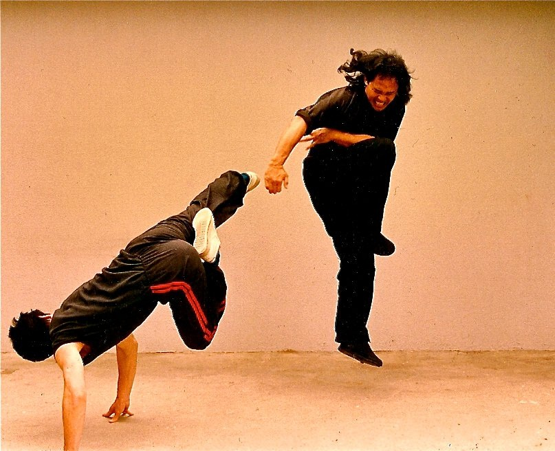

Fonte: https://commons.wikimedia.org/wiki/File:Vernon_Rieta_teaching_Kung_Fu.jpg

# Júnior herda. Sênior ensina.

  

    
<strong>Júnior vai herdar a sujeira</strong>
startup cheia de lixo de IA vai precisar de limpeza

    
<strong>Vai aprender no caos</strong>
igual gerações anteriores aprenderam

    
<strong>Ainda precisa de sênior</strong>
agente nenhum ensina julgamento

  

  

    
<strong>Sênior não é imortal</strong>
muda de empresa, cansa, se aposenta

    
<strong>Nova obrigação</strong>
ensinar engenharia com IA antes do código apodrecer

    
<strong>Sem isso a organização apodrece</strong>
não basta usar IA bem, tem que formar substituto

  

<!--
Restam: ~11:08 (100s)

- Júnior não morreu, só mudou de forma. Vai herdar a sujeira da era do vibe coding sem freio.
- Aprender no projeto bagunçado é como gerações anteriores aprenderam. Não é tragédia, é cicatriz.
- Mas isso só para em pé se sênior fizer o trabalho dele: ensinar engenharia com IA antes do código apodrecer.
- Sênior não é imortal. Se não formar substituto, a organização apodrece.
-->
---

<!-- _class: end -->

Conclusão

Fonte: https://commons.wikimedia.org/wiki/File:Mountain_Climber_In_Mountains_(Unsplash).jpg

# Vai sobreviver quem souber fazer engenharia.

## IA não transforma coder ruim em engenheiro.
## Fundamento. Disciplina. Iteração. Gosto.

<!--
Restam: ~09:33 (95s)

- Parte dura: IA não transforma programador ruim em engenheiro. Ajuda a fazer estrago maior mais rápido.
- E ajuda engenheiro de verdade a atravessar o caos mais rápido, sem deixar o software morrer.
- Então eu fecho assim: vai sobreviver quem tem fundamento, disciplina, iteração e gosto.
- Se você tem isso, IA vira multiplicador. Se não tem, IA é só uma forma mais rápida de ser exposto.
-->
---

<!-- _class: center tone-extra -->

Merchan Sem Vergonha

  

    <h1 style="margin:0 0 18px 0;line-height:0.95;">Assine The M.Akita Chronicles</h1>
    
themakitachronicles.com

    
Se você curtiu essa palestra, vai lá assinar. Toda semana tem bastidor real, código real e projeto real em produção.

  

  

    
  

<!--
Restam: ~09:08 (25s)

- E já que é pra acabar sem falsa modéstia: se você curtiu essa palestra, assina o The M.Akita Chronicles.
- Está tudo aí na tela.
- É onde eu continuo publicando bastidor real, projeto real, código real e o que deu certo ou errado em produção.
- Quer acompanhar essa linha de raciocínio semana a semana? Vai em themakitachronicles.com e assina.
-->
---

<!-- _class: center tone-extra -->

Bastidor — outra aplicação prática

# Traduzindo 20 anos de Posts e 150 vídeos

  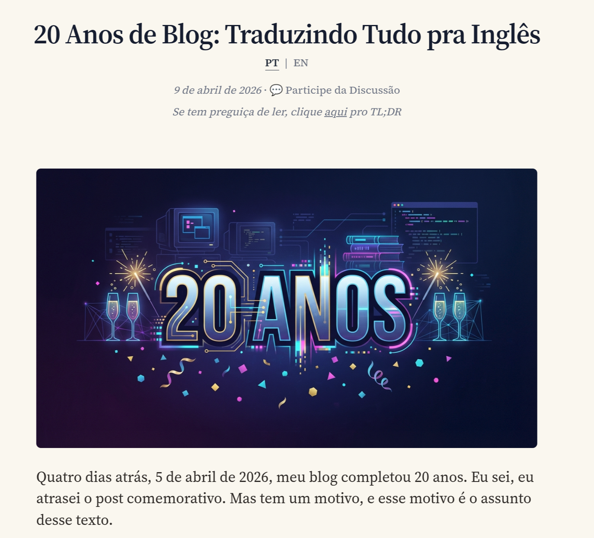
  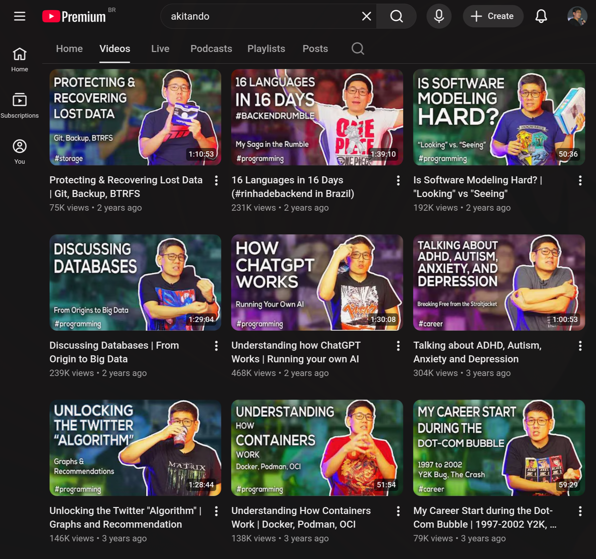

700+ posts em pt-BR e en, agora bilingues. 150+ vídeos do Akitando legendados em inglês — pipeline tudo com agente.

<!--
Restam: ~08:53 (15s)

- Outra prova prática do mesmo argumento da palestra.
- akitaonrails.com: 700+ posts ganharam versão em inglês, com toggle PT/EN.
- Canal Akitando: 150+ vídeos receberam tradução de título, descrição e legenda em inglês.
- Pipeline rodado com agente — não foi "vai traduzir um por um na mão".
- Mesma lógica do resto da palestra: IA como multiplicador de quem já tem o conteúdo, não substituta de quem nunca produziu nada.
-->
---

<!-- _class: center tone-extra -->
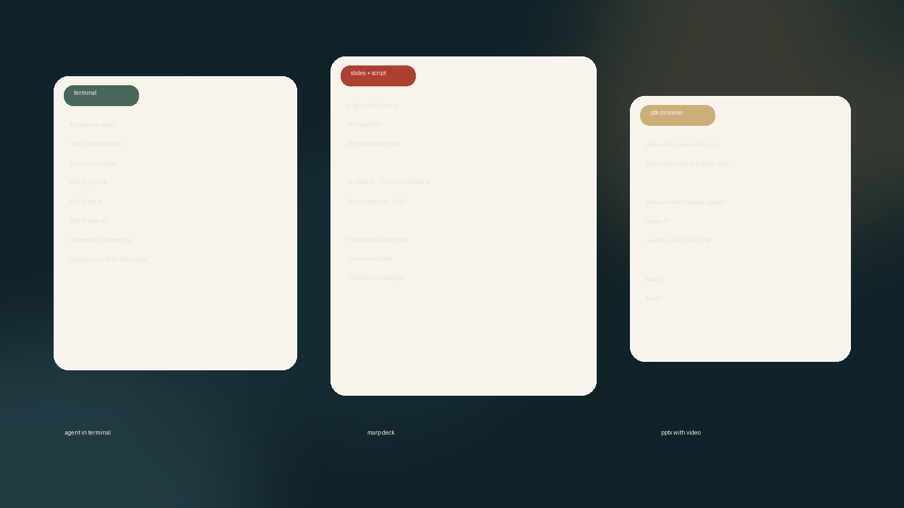

Bastidor

# Sim, este deck inteiro foi feito com IA

  
<strong>Pesquisa e estrutura</strong>
fontes, ordem dos argumentos, cortes e rearranjos

  
<strong>Texto sincronizado</strong>
slides, roteiro e presenter notes mantidos juntos

  
<strong>Mídia e acabamento</strong>
frames, crops, vídeos, builds e pós-processo do PPTX

Agente no terminal, Marp para gerar o deck, scripts para embutir vídeo no PPTX e iteração curta até o resultado fechar.

<!--
Restam: ~08:18 (35s)

- E sim, já que o tema da palestra pede isso, este deck inteiro também foi feito com IA.
- Pesquisa, estrutura, roteiro, notas, crops, builds e automação saíram do mesmo fluxo.
- Agente no terminal, Marp para o deck e script para pós-processar o PPTX com vídeo.
- Não é discurso abstrato. Eu usei isso pra fazer a própria palestra.
-->
---

<!-- _class: center end tone-extra-dark -->
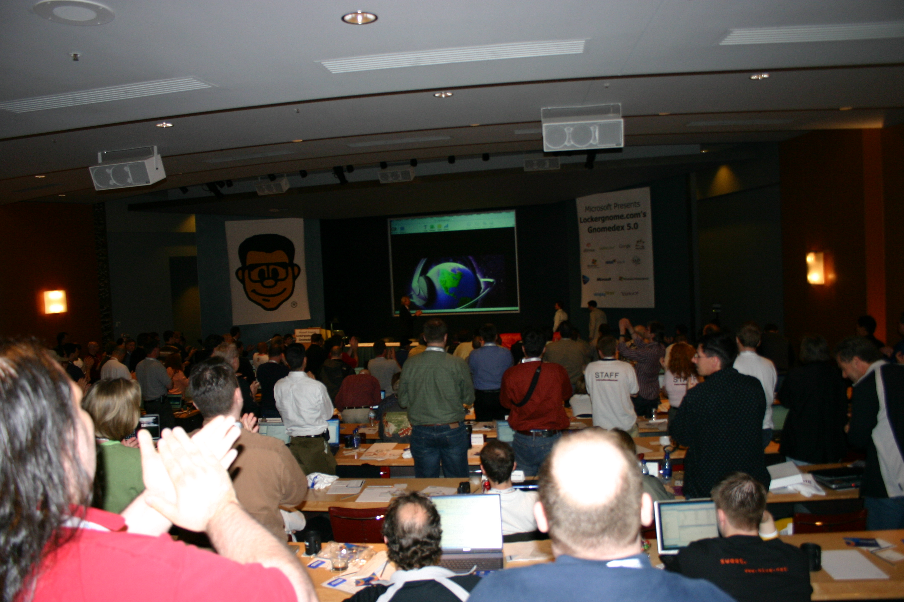

Fonte: https://commons.wikimedia.org/wiki/File:Standing_Ovation_(21835796).jpg

  <h1 style="font-size:3.9em;line-height:0.9;margin:90px 0 70px 0;letter-spacing:0.02em;">OBRIGADO</h1>
  

    

      codeminer42.com
      themakitachronicles.com
      github.com/akitaonrails/tropicalruby-2026
    

  

<!--
Restam: ~08:08 (10s)

- Obrigado.
- Os links estão aí embaixo.
-->
