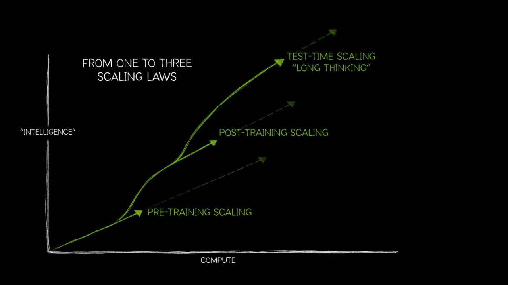
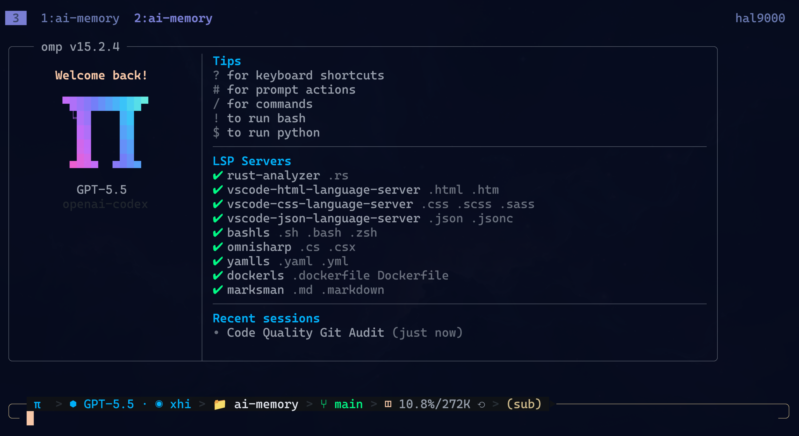
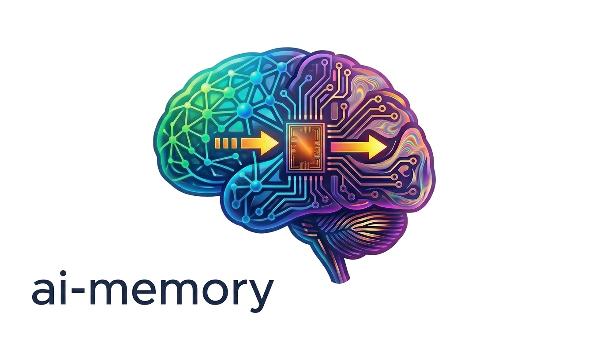
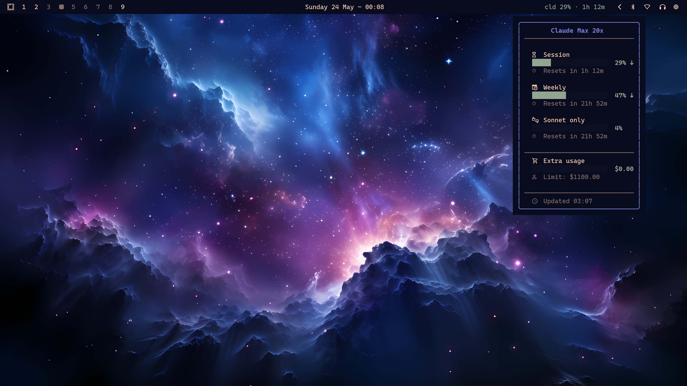
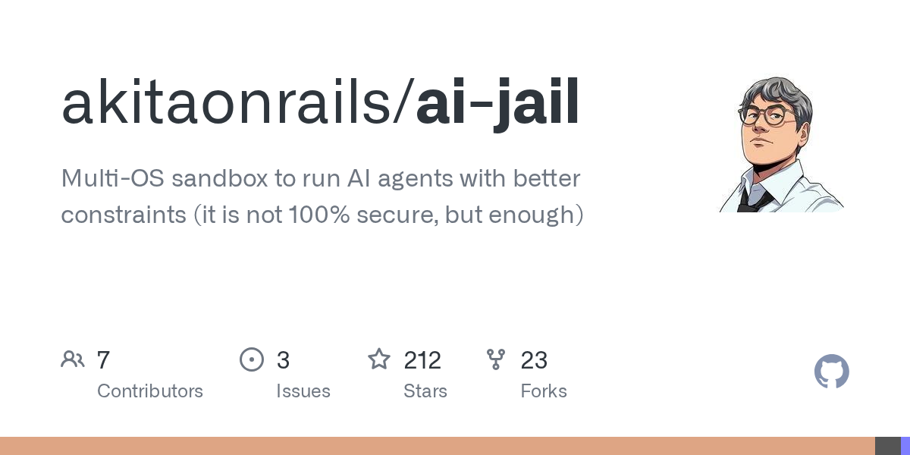
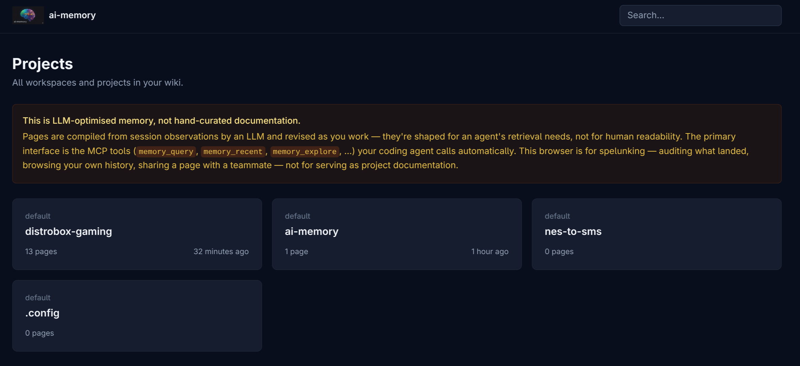

<!-- _class: title -->

Web Summit Rio 2026 Pitch

# AgileVibe Coding

## O Preço de Vibe Coding

<!--
Restam: ~19:10 (50s)

- Abrir direto: isto é uma pitch talk, não a versão longa.
- Tese: agentes mudaram o custo de construir software, mas não aboliram engenharia.
- A pergunta certa não é "IA substitui dev?". É "qual processo sobrevive quando o erro ficou barato?"
-->
---

<!-- _class: center tone-moss -->
# Fabio Akita

  
<strong style="display:block;font-size:1.3em;margin-bottom:6px;">Codeminer 42</strong>cofundador, hoje no conselho

  
<strong style="display:block;font-size:1.3em;margin-bottom:6px;">RubyConf Brasil</strong>fundador e organizador até 2016

  
<strong style="display:block;font-size:1.3em;margin-bottom:6px;">akitaonrails.com</strong>20 anos em 5 de abril de 2026, 700+ artigos, agora em pt-BR e en

  
<strong style="display:block;font-size:1.3em;margin-bottom:6px;"><svg width="22" height="22" viewBox="0 0 24 24" fill="#c4302b" style="vertical-align:-4px;margin-right:6px;"><path d="M23.498 6.186a3.016 3.016 0 0 0-2.122-2.136C19.505 3.545 12 3.545 12 3.545s-7.505 0-9.377.505A3.017 3.017 0 0 0 .502 6.186C0 8.07 0 12 0 12s0 3.93.502 5.814a3.016 3.016 0 0 0 2.122 2.136c1.871.505 9.376.505 9.376.505s7.505 0 9.377-.505a3.015 3.015 0 0 0 2.122-2.136C24 15.93 24 12 24 12s0-3.93-.502-5.814zM9.546 15.568V8.432L15.818 12l-6.272 3.568z"/></svg>@akitando</strong>500 mil+ seguidores no YouTube

  
<strong style="display:block;font-size:1.3em;margin-bottom:6px;"><svg width="20" height="20" viewBox="0 0 24 24" fill="currentColor" style="vertical-align:-3px;margin-right:6px;"><path d="M18.244 2.25h3.308l-7.227 8.26 8.502 11.24H16.17l-5.214-6.817L4.99 21.75H1.68l7.73-8.835L1.254 2.25H8.08l4.713 6.231zm-1.161 17.52h1.833L7.084 4.126H5.117z"/></svg>@akitaonrails</strong>83,7 mil seguidores no X

  
<strong style="display:block;font-size:1.3em;margin-bottom:6px;">Flow + Inteligência Ltda</strong>alcance além da bolha tech

<!--
Restam: ~18:25 (45s)

- Contexto rápido, sem virar currículo.
- Já vi hype demais para comprar fantasia fácil.
- O valor aqui vem de teste prático, código aberto e anos vendo moda passar.
-->
---

<!-- _class: statement -->

Antes do GPT

# A bolha era velha.

## O ChatGPT foi o prego no caixão.

  
<strong>2020-2022</strong> eu já batia na promessa "qualquer um programa"

  
<strong>fim de 2022</strong> a correção começou antes da IA programar direito

<!--
Restam: ~17:40 (45s)

- Amarrar autoridade: não comecei a falar disso quando IA virou moda.
- O canal de 500k+ já vinha batendo na bolha do programador fake e nos cursos prometendo atalho.
- ChatGPT apareceu logo depois e virou o prego no caixão da fantasia.
-->
---

<!-- _class: center tone-moss -->

2022-2024

# A corrida era parâmetro + compute

  

    
<strong>GPT-3</strong>
175B parâmetros virou o marco público da era moderna

    
<strong>PaLM / Llama / DeepSeek</strong>
centenas de bilhões; MoE chega para ativar só parte do modelo

    
<strong>Lei de escala</strong>
mais dado + mais parâmetro + mais compute ainda ajuda, mas cobra caro

  

  

    
    
NVIDIA, 2025: pretraining, post-training e test-time scaling.

  

<!--
Restam: ~16:55 (45s)

- A história até ali era intuitiva: maior modelo, mais dados, mais GPU.
- Isso entregou GPT-3, PaLM, Llama grande, DeepSeek V3 671B MoE.
- Mas aumento de parâmetro começou a cobrar cada vez mais por ganho incremental.
-->
---

<!-- _class: center tone-sand -->

O gargalo mudou

# De treino gigante para inferência útil

  
<strong>Treino ficou caro</strong>
frontier training já passa de 100 MW; Epoch projeta múltiplos GW até 2030

  
<strong>Data center é lento</strong>
transformador, energia, terreno, conexão: não nasce em sprint

  
<strong>Uso virou carga</strong>
agente troca um prompt por dezenas de chamadas, tool calls e retries

O ganho passou a vir de usar melhor o modelo existente: reasoning, tool calling, KV cache, prompt caching e harness maduro.

<!--
Restam: ~16:10 (45s)

- Não dizer que scaling morreu; dizer que o ganho marginal ficou caro.
- Data center é escasso e lento; parte relevante da pressão vai para inferência conforme o uso cresce.
- Agents aproveitam otimizações de inferência e ferramenta, sem depender de mais uma ordem de magnitude de parâmetro.
-->
---

<!-- _class: center tone-moss -->

A mudança real

Fonte: https://commons.wikimedia.org/wiki/File:Smith_Matrix_mannequins.jpg

# 2025 foi o ano dos AGENTES

  
<strong>mar 2025</strong>Responses API, tools e Agents SDK viram produto

  
<strong>mai 2025</strong>Claude 4 pensa entre tool calls e Claude Code vira GA

  
<strong>ago 2025</strong>GPT-5 aguenta loop mais longo e erra menos no uso de ferramenta

  
<strong>nov 2025</strong>GPT-5.1 e Opus 4.5 refinam uso diário

Não foi chatbot mais esperto. Foi modelo, ferramenta, terminal e loop fechando juntos.

<!--
Restam: ~15:15 (55s)

- O produto mudou de autocomplete para agente operacional.
- Thinking/reasoning, tool calling e caching viraram a diferença prática.
- Harness maduro é o que deixa isso virar trabalho diário, não demo.
-->
---

<!-- _class: center -->

# Fevereiro a maio de 2026

## eu parei de falar  
## e fui maratonar

Fonte: https://commons.wikimedia.org/wiki/File:Mount_Everest_as_seen_from_Drukair2_PLW_edit.jpg

<!--
Restam: ~14:55 (20s)

- Pele em jogo.
- Nada de prompt de brinquedo ou demo de SaaS fake.
- Projeto real, bug real, deploy real, pós-produção real.
-->
---

<!-- _class: center tone-sand -->

Painel de projetos

Fonte: https://commons.wikimedia.org/wiki/File:Potter_shaping_clay_on_a_traditional_manual_potter’s_wheel_in_India_01.jpg

# Do zero pra software real

  
  
  
  
  
  
  
  

<!--
Restam: ~14:30 (25s)

- Não explicar projeto por projeto nesta versão.
- Mostrar variedade: desktop, Rails, Rust, Flutter, mídia, deploy, ferramenta de uso real.
- O ponto é escala de experimentação, não portfólio bonito.
-->
---

<!-- _class: center tone-moss -->

Repositórios públicos

# 26 projetos (experimentais)

  

    
github.com/akitaonrails - tudo aberto, inclusive os erros.

    
"Todos os 26 projetos são perfeitos, modelos de excelência de código?" <strong>Absolutamente não.</strong> Alguns viraram software de uso diário, outros são protótipos. O importante foi rodar o ciclo de verdade.

  

  

    
  

<!--
Restam: ~14:05 (25s)

- 26 projetos, várias linguagens, vários domínios.
- Disclaimer honesto: experimental não é sinônimo de perfeito.
- A prova não é "olha que produto lindo". É "rodei o ciclo em escala".
-->
---

<!-- _class: center tone-sand -->

A prova pratica

Fonte: https://commons.wikimedia.org/wiki/File:Master-Swordsmith-Goro-Masamune-Ukiyo-e.png

# Mesmo dev. Mesmo agente. Processo diferente.

  
<strong>FrankMD</strong> 212 commits em 19 dias, refactor pesado, teste correndo atras

  
<strong>M.Akita Chronicles</strong> 274 commits em 8 dias, TDD, CI e refatoração contínua

A variável não foi "IA melhor". Foi disciplina de engenharia desde o primeiro commit.

<!--
Restam: ~13:05 (60s)

- Esta comparação é o coração da palestra curta.
- Mesmo dev, mesmo agente, resultado diferente por causa do processo.
- FrankMD pagou decisão tardia. Chronicles começou com TDD, CI e refatoração contínua.
-->
---

<!-- _class: center tone-sand -->

Recorte Web Summit Rio 2026

Fonte: https://commons.wikimedia.org/wiki/File:African_Bull_elephant_walking_towards_camera_in_August_2013.jpg

# Números que pesam

  
<strong>432.134</strong>linhas úteis

  
<strong>62.643</strong>linhas de teste

  
<strong>2.241</strong>commits

  
<strong>~473 h</strong>horas ativas estimadas

Agregado de 26 projetos AI-assisted: `tokei` sem linhas em branco, contando código + comentários + markdown/conteúdo rastreado. `shadPS4` só na branch `gamma-debug`; `akitaonrails-hugo` só no recorte AI-era. Testes separados por path. Fora: assets, vendor, build, fixtures, snapshots e árvore de terceiros.

<!--
Restam: ~12:00 (65s)

- Ferramenta: `bin/totalpass-metrics`, usando `tokei`.
- Critério: linha útil rastreada em git; sem branco, asset, vendor, build ou árvore de terceiros.
- Horas: sessões por commit, 90 min de corte, +20 min por sessão, teto de 8h.
- Não é tudo que trabalhei. É só o que dá para defender olhando commit.
-->
---

<!-- _class: center tone-sand -->

Fonte: https://commons.wikimedia.org/wiki/File:Basra_bodybuilding_competition_DVIDS288972.jpg

# Alcançamos "Developer 10x"?

  
<strong>5x a 10x</strong>de velocidade

  
<strong>Mais tração</strong>menos bloqueio, menos procrastinação

  
<strong>Mais alcance</strong>stack inteira, ferramentas, deploy, documentação

  
<strong>Mais confiança</strong>testes, CI, refatoração, produção

<!--
Restam: ~11:10 (50s)

- Resumo honesto da experiência: 5x a 10x em muitas tarefas.
- Não porque modelo ficou perfeito.
- O ganho vem de reduzir atrito: busca, repetição, teste, refactor, comando, tentativa rápida.
- Confiança só veio quando teste, CI e revisão continuaram no loop.
-->
---

<!-- _class: center tone-moss -->

Fonte: https://commons.wikimedia.org/wiki/File:Thurston,_master_magician_all_out_of_a_hat._LCCN2014636958.jpg

# Prompt único é pra demo

  
<strong>Produção é iteração</strong> bug, deploy, retorno, refatoração, ajuste de prompt

  
<strong>"Pronto" é mentira</strong> 125 commits de pós-produção em 4 projetos

<!--
Restam: ~10:25 (45s)

- A fantasia do prompt único vende bem no palco, mas morre em produção.
- Software real revela requisito, falha de API, bug de infra e uso que ninguém previu.
- Agente bom precisa de loop, não de uma frase mágica.
-->
---

<!-- _class: center tone-moss -->

Nome verdadeiro

# Agile Vibe Coding

## é XP com pareamento de máquina

  
<strong>TDD</strong>
segura erro de modelo antes de virar lama

  
<strong>CI por commit</strong>
pega drift e regressão cedo

  
<strong>Refatoração contínua</strong>
evita cirurgia cara depois

<!--
Restam: ~09:25 (60s)

- O termo pega, mas por baixo é XP.
- TDD, CI e refatoração não ficaram velhos. Ficaram mais importantes.
- Com agente, dívida técnica cresce rápido. O freio também precisa ficar rápido.
-->
---

<!-- _class: center tone-moss -->

Fonte: https://commons.wikimedia.org/wiki/File:Pair_Programming.jpg

# O pareamento mudou

  
<strong>Eu trago</strong> direção, julgamento, contexto, gosto

  
<strong>O agente traz</strong> velocidade de execução, busca, fôlego operacional

IA é espelho: sênior bom ganha alavancagem, programador ruim ganha velocidade pra errar.

<!--
Restam: ~08:35 (50s)

- Divisão de responsabilidade: humano dirige, agente executa rápido.
- Reduzir agente a digitador burro desperdiça ferramenta.
- Entregar arquitetura para ele sozinho também piora.
-->
---

<!-- _class: center tone-sand -->

Código e dados públicos

# github.com/akitaonrails/ llm-coding-benchmark

  

<!--
Restam: ~08:20 (15s)

- Tudo aberto: prompt, runner, config e resultados.
- Quatro rodadas documentadas entre abril e maio.
- Ponte rápida para o ranking.
-->
---

<!-- _class: center tone-sand -->

Resultado consolidado

# Maio/2026

  

<!--
Restam: ~07:30 (50s)

- 24 modelos, mesma tarefa, score 0-100, Tier A/B/C/D.
- Topo: Opus 4.7 e GPT 5.4 empatam em 97. GPT 5.5 vem em 96 e custa menos.
- DeepSeek V4 Pro e Kimi K2.6 mostram que o gap fechou, mas só quando o harness aguenta.
- Mensagem: escolher modelo importa, mas o fluxo importa mais.
-->
---

<!-- _class: center tone-moss -->

O que separa Tier A

Fonte: https://commons.wikimedia.org/wiki/File:The_Thinker_detail_of_the_Gates_of_Hell_Rodin_musée_Rodin_S.01304_Paris.jpg

# Não é mais só parâmetro

  
<strong>Prompt caching</strong>
sem cache, cada turno relê o contexto inteiro e o custo explode

  
<strong>Tool calling</strong>
o modelo precisa chamar ferramenta certa, com argumento certo

  
<strong>Reasoning</strong>
budget extra para planejar antes de agir

Tamanho virou commodity. Agente real precisa de infraestrutura de inferência, não só parâmetro no release note.

<!--
Restam: ~06:35 (55s)

- A pergunta do ranking: por que poucos modelos aguentam?
- Parâmetro virou commodity.
- O que separa: cache, tool calling e reasoning trabalhando juntos.
- Sem isso, o modelo até sabe responder, mas não aguenta um loop de agente.
-->
---

<!-- _class: center tone-moss -->

A virada econômica

Fonte: https://commons.wikimedia.org/wiki/File:Kintsugi.jpg

# IA nunca vai ser perfeita.

## Mas errar ficou barato.

  
<strong>Roda</strong>
agente executa, testa, quebra e mostra o stack trace

  
<strong>Corrige</strong>
o loop volta em segundos, não em dias

  
<strong>Decide</strong>
humano ainda corta escopo, arquitetura e risco

<strong>Barato:</strong> CRUD, landing page, painel interno, bot, ETL, cola entre APIs. &nbsp;|&nbsp; <strong>Caro:</strong> julgamento, arquitetura, operação, dono do problema.

<!--
Restam: ~05:45 (50s)

- A leitura errada é esperar modelo perfeito.
- A leitura certa: o custo do erro caiu.
- Stack trace, conserto e retry em segundos mudam a economia do software trivial.
- Mas decisão, arquitetura e operação continuam caros.
-->
---

<!-- _class: center tone-sand -->

Recomendação prática

# As únicas ferramentas pra usar agora

  

    
    
<strong>Claude Code</strong>

  

  

    
    
<strong>Codex</strong>

  

  

    
    
<strong>opencode</strong>

  

  

    
    
<strong>Oh-My-Pi</strong>

  

<!--
Restam: ~05:15 (30s)

- Em maio de 2026, estes quatro cobrem o caso sério de agente de terminal.
- Claude Code e Codex para fronteira fechada.
- opencode e Oh-My-Pi para modelo agnóstico, benchmark e OpenRouter.
-->
---

<!-- _class: center tone-sand -->

Toolkit open source

Fonte: https://commons.wikimedia.org/wiki/File:Server_Rack_with_Spaghetti-Like_Mass_of_Network_Cables.jpg

# Trocar de harness sem perder controle

  

    
    <strong style="font-size:1.2em;">ai-jail</strong>
    
autonomia do agente com cerca no filesystem

  

  

    
    <strong style="font-size:1.2em;">ai-memory</strong>
    
contexto que sobrevive ao Claude, Codex e opencode

  

  

    
    <strong style="font-size:1.2em;">ai-usagebar</strong>
    
limite de plano visível antes de travar no meio da refatoração

  

<!--
Restam: ~04:50 (25s)

- Não é mais um orquestrador mágico.
- É kit de operação: cerca, memória e medidor de limite.
- Usagebar é apoio. Jail e memory são os conceitos importantes para trocar de harness sem virar bagunça.
-->
---

<!-- _class: center tone-ruby -->

ai-jail

# Autonomia com cerca

  
<strong>Modo sem freio no harness</strong>
Claude/Codex com permissões perigosas, menos confirmação a cada passo

  
<strong>Trava no sistema operacional</strong>
projeto read-write; host, home, cache e dotfiles ficam fora ou controlados

  
<strong>Política versionável</strong>
`.ai-jail`, `--dry-run`, `--mask .env`, `--private-home`, `--lockdown`

Não é VM nem blindagem militar. É uma camada prática para deixar o agente trabalhar rápido sem dar a chave da casa.

<!--
Restam: ~04:10 (40s)

- Uso preferido: tirar fricção dentro do harness, colocar a trava no OS.
- O agente trabalha rápido no projeto; o resto do host não fica aberto por acidente.
- Não vender como segurança absoluta: sandbox de processo não é VM.
-->
---

<!-- _class: center tone-moss -->

ai-memory

<h1 style="font-size:2.45em;line-height:0.95;margin:0 0 16px 0;">Contexto que sobrevive ao harness</h1>

  

    
    
<strong style="font-size:1.05em;">Hooks capturam</strong>
prompt, tool call, decisão e boundary de sessão

    
<strong style="font-size:1.05em;">Markdown vira memória</strong>
wiki versionável, FTS5, handoff e busca via MCP

    
<strong style="font-size:1.05em;">Troca de agente sem reexplicar</strong>
fecha Claude hoje, abre Codex amanhã no mesmo diretório

  

  

    
    
Não substitui `docs/` canônico. Cobre gotchas, decisões transitórias e handoff entre sessões.

  

<!--
Restam: ~03:30 (40s)

- Problema: harness compacta ou acaba, e o próximo agente esquece as últimas horas.
- ai-memory captura e consolida em markdown pesquisável.
- Documentação importante ainda vai para `docs/`; memória cobre o transitório que seria perdido.
-->
---

<!-- _class: statement -->

A regra que não mudou

Fonte: https://commons.wikimedia.org/wiki/File:Peter_Candid_(attr)_Allegory_of_vanity.jpg

# IA reflete quem você é

## Ela te acelera: se você for bom, fica melhor. Se for ruim, vai errar mais rápido.

<!--
Restam: ~02:50 (40s)

- IA não cria competência do nada.
- Bom engenheiro ganha alavancagem.
- Mau engenheiro ganha velocidade para produzir lixo.
- Esta é a ponte para o fechamento.
-->
---

<!-- _class: end -->

Conclusão

Fonte: https://commons.wikimedia.org/wiki/File:Mountain_Climber_In_Mountains_(Unsplash).jpg

# Vai sobreviver quem souber fazer engenharia.

## IA não transforma coder ruim em engenheiro.
## Fundamento. Disciplina. Iteração. Gosto.

<!--
Restam: ~01:55 (55s)

- Fechar sem moralismo longo.
- IA ajuda programador ruim a fazer estrago maior mais rápido.
- Ajuda engenheiro bom a atravessar o caos sem deixar o software morrer.
- Não é truque de prompt. É fundamento, disciplina, iteração e gosto.
-->
---

<!-- _class: center tone-extra -->

Akitando

# O canal também virou inglês

  

    
<strong>150+ vídeos</strong>
traduzidos e legendados com agente

    
<strong>20 anos de conteúdo</strong>
blog bilingue e canal pronto pra mandar pra fora

    
youtube.com/@Akitando

  

  

    
  

<!--
Restam: ~01:45 (10s)

- Merchan rápido: canal traduzido.
- 150+ vídeos do Akitando em inglês.
- Pipeline com agente, não trabalho manual.
-->
---

<!-- _class: center tone-extra -->

Merchan sem vergonha

  

    <h1 style="margin:0 0 18px 0;line-height:0.95;">Assine The M.Akita Chronicles</h1>
    
themakitachronicles.com

    
Notícias de tecnologia, opinião, código aberto e bastidor de projeto real. Toda semana.

  

  

    
  

<!--
Restam: ~01:35 (10s)

- Segundo merchan rápido.
- Newsletter semanal: notícias de tecnologia, opinião, código aberto e bastidor real.
- Link: themakitachronicles.com.
-->
---

<!-- _class: center tone-extra -->

Bastidor

# Sim, este deck inteiro foi feito com IA

  
<strong>Pesquisa e estrutura</strong>
fontes, ordem dos argumentos, cortes e rearranjos

  
<strong>Texto sincronizado</strong>
slides, roteiro e presenter notes mantidos juntos

  
<strong>Mídia e acabamento</strong>
frames, crops, builds e pós-processo do PPTX

Agente no terminal, Marp para gerar o deck, scripts para automatizar build e iteração curta até o resultado fechar.

<!--
Restam: ~01:05 (30s)

- Meta-stinger curto, sem virar propaganda.
- A própria palestra foi feita com a pilha que estou defendendo.
- Pesquisa, roteiro, notas, cortes, build e acabamento no mesmo fluxo.
-->
---

<!-- _class: center end tone-extra-dark -->

Fonte: https://commons.wikimedia.org/wiki/File:Standing_Ovation_(21835796).jpg

  <h1 style="font-size:3.9em;line-height:0.9;margin:90px 0 70px 0;letter-spacing:0.02em;">OBRIGADO</h1>
  

    

      codeminer42.com
      themakitachronicles.com
      github.com/akitaonrails/tropicalruby-2026
    

  

<!--
Restam: ~01:00 (5s)

- Obrigado.
- Links no rodapé.
-->
