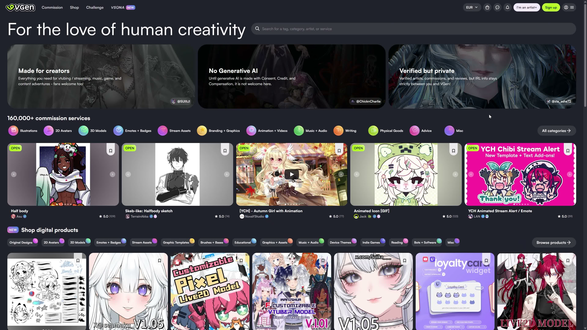
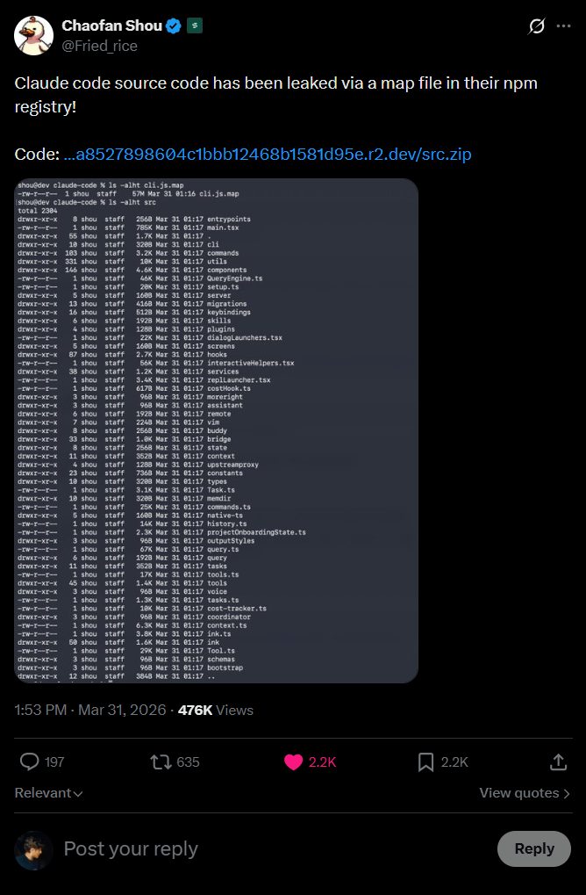
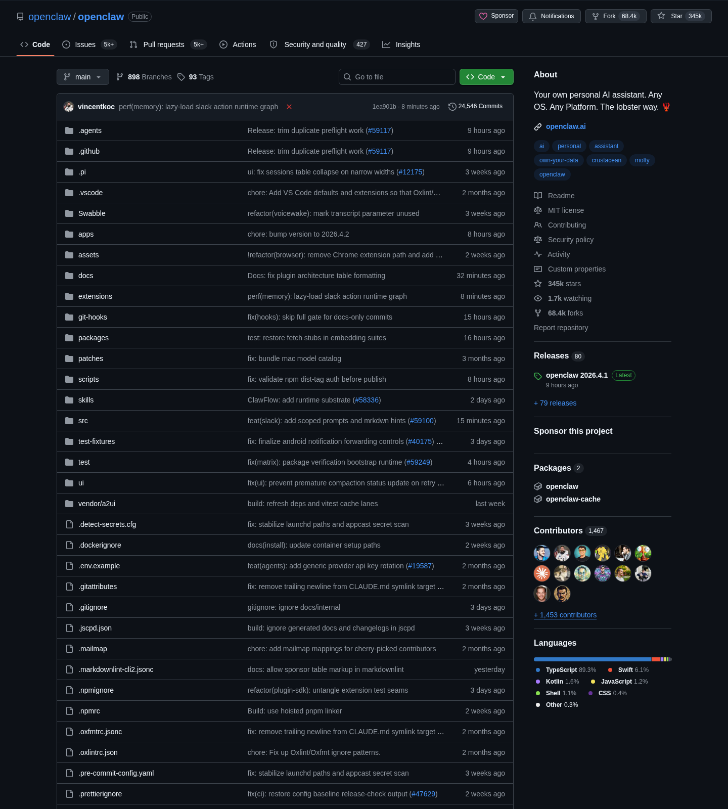
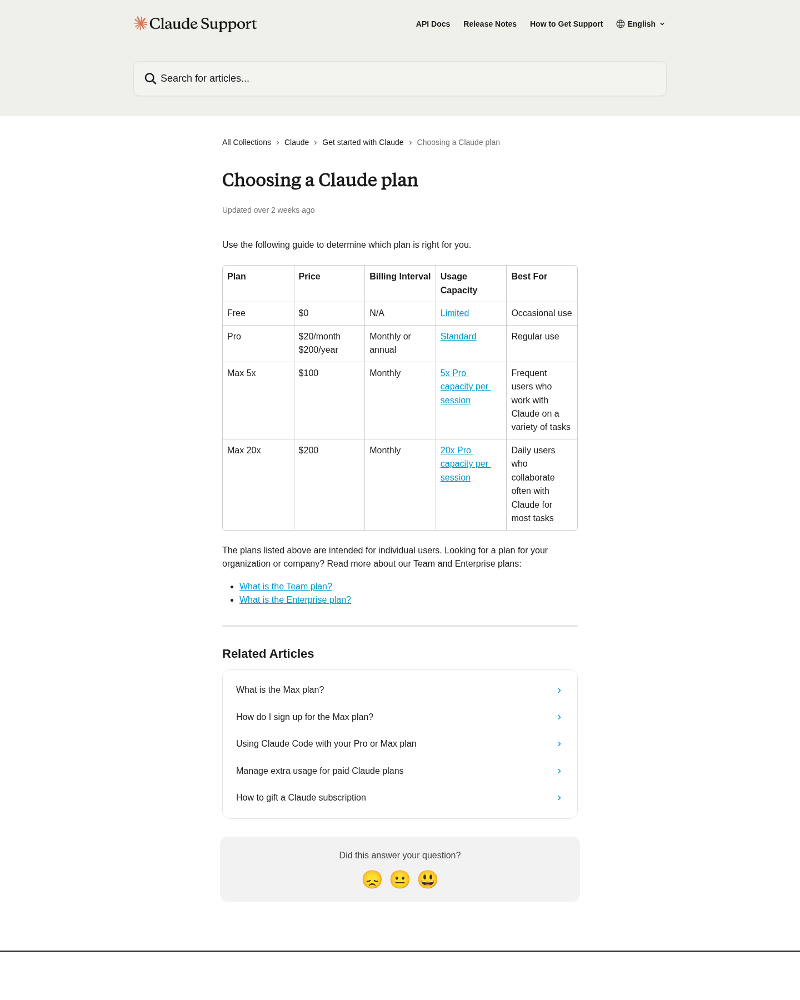
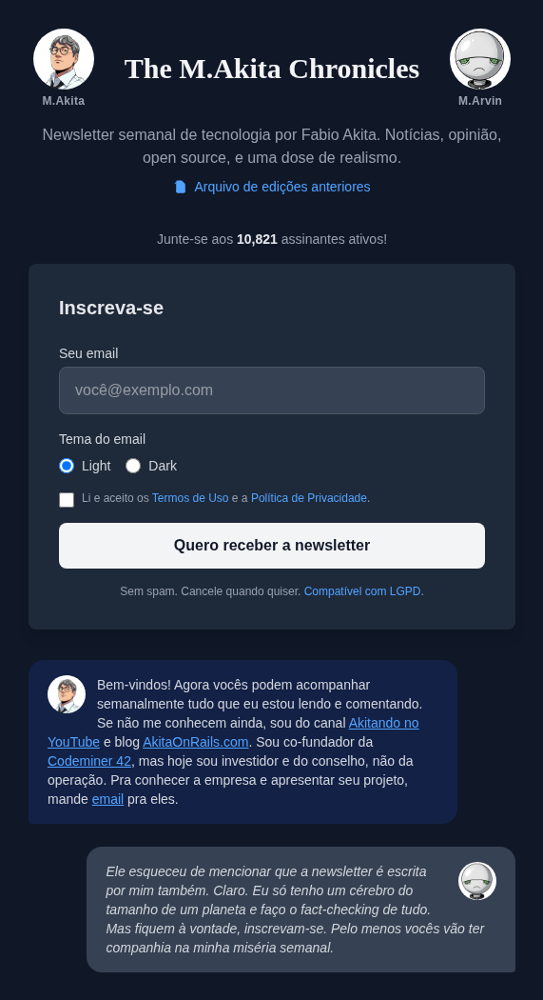

<!-- _class: title -->

Tropical Ruby 2026 Keynote

# Agile Vibe Coding
## IA substitui
## programador ruim.
## Não engenharia.

<!--
Tempo sugerido: ~0:45

- Eu quero abrir cravando a tese, porque o resto da palestra existe só pra sustentar isso.
- Sim, IA está substituindo gente em software.
- Mas não do jeito raso que o pânico de internet adora vender.
- O que ela pega primeiro é produtividade fake, senioridade fake e aquela engenharia porca que sobreviveu durante anos porque o mercado aceitava jogar dinheiro fora.
-->
---

<!-- _class: center tone-moss -->
# Fabio Akita

  
<strong>Codeminer 42</strong>cofundador, hoje no conselho

  
<strong>RubyConf Brasil</strong>fundador e organizador até 2016

  
<strong>@akitando</strong>500 mil+ seguidores

  
<strong>Flow + Inteligência Ltda</strong>alcance além da bolha tech

<!--
Tempo sugerido: ~0:40

- Pra quem só me conhece por um pedaço da internet: fui cofundador da Codeminer 42 e hoje estou no conselho.
- Fundei e organizei a RubyConf Brasil até 2016.
- Passei anos no YouTube com o Akitando.
- E também fui parar fora da bolha tech, em programas como Flow e Inteligência Ltda.
-->
---

<!-- _class: statement -->

Arco Longo

# O pânico da IA
# caiu em cima
# de uma bolha velha.

Eu já vinha batendo na economia do programador fake antes de agentes de código prestarem pra alguma coisa.

<!--
Tempo sugerido: ~0:45

- Eu não comecei a falar disso quando IA virou moda.
- Eu já vinha batendo na bolha da programação, na economia do programador ruim, nas promessas de curso e bootcamp, muito antes de agente de código prestar pra alguma coisa.
- A IA não inventou essa fraqueza.
- Ela só escancarou mais rápido.
-->
---

<!-- _class: center -->

2019 → 2026

# Mesma tese.
# Ferramenta nova.

  
<strong>2019</strong>o inverno estava chegando

  
<strong>2020</strong>programação não é fácil

  
<strong>2022</strong>a bolha estourou

  
<strong>2025</strong>LLMs são loot boxes

  
<strong>2026</strong>agentes ficaram úteis

<!--
Tempo sugerido: ~0:50

- Tem uma linha reta aqui.
- Em 2019 eu já avisava que a bolha ia azedar.
- Em 2020 eu continuava repetindo que programação não é fácil.
- Em 2022 a bolha estourou de vez.
-->
---

<!-- _class: center -->
# A mentira antiga

## “vire engenheiro
## de software
## em 2 meses”

  
<strong>Fim de 2022</strong> layoffs vieram antes da IA saber programar direito

  
<strong>ChatGPT</strong> foi acelerador, não causa original

<!--
Tempo sugerido: ~0:55

- A mentira antiga era simples: faz um cursinho rápido, vira engenheiro de software, ganha salário alto e entra no modo easy.
- Isso sempre foi conversa mole.
- Bootcamp ensina ferramenta.
- Não comprime anos de julgamento de engenharia em poucos meses.
-->
---

<!-- _class: center -->

A Analogia

# Mesmo medo.

## “IA vai substituir artista.”  
## “IA vai substituir programador.”

<!--
Tempo sugerido: ~0:35

- Pra explicar o pânico atual, eu quero fazer uma tangente rápida com um universo que eu acompanho por hobby: drama de VTuber e drama de arte.
- O padrão emocional é o mesmo.
- No mundo da arte dizem que IA vai substituir artista.
- No nosso dizem que IA vai substituir programador.
-->
---

<!-- _class: center tone-ruby -->
# Caso AsamiArts

  

    

      <strong>Isso não é só drama de internet</strong> 
      tem mercado, comissão e renda real em volta disso
    

    
O ponto aqui não é fofoca. É processo falso vendido como habilidade real dentro de um mercado que vive de confiança.

  

  

    
  

<!--
Tempo sugerido: ~0:45

- O caso da AsamiArts me interessa não pela fofoca, mas pelo mecanismo.
- Isso não afeta só ego de artista no Twitter.
- Tem mercado real de comissão em volta disso.
- Quando processo falso entra, confiança sai.
-->
---

<!-- _class: center tone-ruby -->
# Tracing sem processo

<!-- pptx-video: asamiarts-tracing -->

  

    <ul>
      <li>não aparece construção bruta antes</li>
      <li>não aparece ida e volta de correção</li>
      <li>não aparece undo, hesitação, ajuste de proporção</li>
      <li>parece “mão firme”, mas parece firme demais</li>
    </ul>
    
No PPTX com vídeo: clique para reproduzir.

  

  

    
  

<!--
Tempo sugerido: ~0:55

- Aqui é onde eu mostro o que um tracing falso tenta vender.
- Não tem sketch feio antes.
- Não tem correção de construção no meio.
- Sai limpo demais, reto demais, confiante demais.
-->
---

<!-- _class: center tone-ruby -->
# A camada escondida

<!-- pptx-video: tracing-hidden-layer -->

  

    <ul>
      <li>o vídeo não mostra o desenho “nascendo” de verdade</li>
      <li>minha leitura é que existe uma camada base escondida por trás</li>
      <li>o verde parece estar ali para sumir na edição</li>
      <li>sem a camada escondida, a mágica some</li>
    </ul>
    
Inferência a partir do vídeo: isso parece truque de gravação, não processo honesto.

  

  

    
  

<!--
Tempo sugerido: ~0:55

- Esse é o pedaço mais importante.
- Minha leitura é que o vídeo esconde uma camada pronta por trás.
- O verde parece estar ali justamente para ser filtrado depois.
- O vídeo vende tracing; o truque está na composição.
-->
---

<!-- _class: center tone-ruby -->
# A evolução não bate

  

    
<strong>em pouco tempo muda demais</strong> traço, rosto, acabamento e construção saltam sem continuidade

    
Evolução humana existe, claro. O problema é quando a “mão” parece trocar de pessoa em intervalos curtos demais.

  

  

    
  

<!--
Tempo sugerido: ~0:50

- Outro sinal é a inconsistência.
- Não é só “melhorou”.
- A mão muda demais em pouco tempo.
- Parece mistura de fontes diferentes, não evolução orgânica.
-->
---

<!-- _class: center tone-ruby -->
# A alucinação entrega

  

    
<strong>o cano está do lado errado</strong> isso não é detalhe de estilo; é erro estrutural de entendimento

    
É o mesmo tipo de erro que a gente já conhece em IA: a imagem parece plausível à primeira vista, mas desmonta quando você olha a anatomia do objeto.

  

  

    
  

<!--
Tempo sugerido: ~0:45

- Aqui entra a alucinação mais óbvia.
- A arma parece arma até você olhar direito.
- O cano está do lado errado.
- Isso é erro de entendimento, não acabamento.
-->
---

<!-- _class: center tone-ruby -->
# LoRA é estilo empacotado

  

    <ul>
      <li>LoRA é um ajuste leve em cima de um modelo base</li>
      <li>ele empurra o modelo para um traço, tema ou artista específico</li>
      <li>a comunidade treinou muita LoRA com imagem pública e zero autorização</li>
      <li>depois isso volta disfarçado de “meu estilo”</li>
    </ul>
  

  

    
  

<!--
Tempo sugerido: ~0:55

- E tem outra camada aí: LoRA.
- LoRA é um ajuste leve em cima de um modelo base para puxar um traço específico.
- O problema é que muita LoRA foi treinada com arte pública sem autorização.
- Aí o roubo de estilo volta embalado como ferramenta.
-->
---

<!-- _class: statement -->

Mesma Regra No Código

# Trabalho de verdade
# parece bagunçado.

## IA só amplifica o que já estava lá.

<!--
Tempo sugerido: ~1:00

- E é aqui que isso volta pro código.
- Trabalho de verdade parece bagunçado.
- Artista de verdade erra, corrige, revisa, ajusta composição, muda junto com o pedido do cliente.
- Engenheiro de verdade faz a mesma coisa.
-->
---

<!-- _class: center tone-ruby -->

31 de março de 2026

# Claude Code vazou

  
<strong>512 mil</strong>linhas de TypeScript

  
<strong>1.900</strong>arquivos

  
<strong>59,8 MB</strong>de mapa do código exposto

  
<strong>6,5/10</strong>o “espaguete de sênior”

<!--
Tempo sugerido: ~0:45

- Daí veio uma das confirmações mais engraçadas possíveis dessa tese: o vazamento do Claude Code em 31 de março de 2026.
- A CLI oficial da Anthropic deixou escapar um mapa enorme do código e, de repente, todo mundo pôde olhar as tripas de uma das ferramentas de agente mais importantes do mercado.
-->
---

<!-- _class: center -->

A Faísca

  

    <h1 style="margin:0 0 18px 0;line-height:0.95;">Não foi rumor. Foi vazamento.</h1>
    
A imagem de abertura do seu artigo já conta a história inteira: source map exposto, árvore de arquivos na mão de todo mundo e a mística indo embora em tempo real.

  

  

    
  

<!--
Tempo sugerido: ~0:20

- E eu quis colocar a imagem de abertura do artigo justamente por isso.
- Ela resume o clima do negócio em um frame: o tweet, o link, a árvore de arquivos aparecendo, e a internet inteira percebendo em tempo real que dava pra abrir a caixa-preta.
- A mística acabou ali.
-->
---

<!-- _class: center tone-ruby -->
# A lição não foi
# “uau, magia”

  
<strong>Nem a Anthropic escapa</strong> pressão de entrega também gera código tático

  
<strong>E copiaram rápido</strong> free-code e reimplementações apareceram quase na hora

<!--
Tempo sugerido: ~1:00

- E o que apareceu lá dentro? Não apareceu perfeição divina.
- Não apareceu magia.
- Apareceu uma base grande, pressionada por entrega, cheia de decisão tática, chave de recurso, remendo e complexidade operacional.
- O famoso espaguete de sênior.
-->
---

<!-- _class: statement -->

Meu Ponto

# IA não eliminou
# engenharia.

## Eliminou desculpa.

<!--
Tempo sugerido: ~0:35

- Então meu ponto central é esse: IA não eliminou a necessidade de engenharia.
- Ela eliminou desculpa.
- Ela escancarou a diferença entre quem sabe fazer sistema sobreviver em produção e quem só sabe produzir resposta plausível.
-->
---

<!-- _class: center tone-sand -->
# LLMs são loot boxes

  
<strong>Probabilísticas</strong>
nunca 100% confiáveis

  
<strong>Dependem de contexto</strong>
qualidade depende do que você dá e do que você checa

  
<strong>Gastam loop</strong>
o ecossistema inteiro te incentiva a gastar mais tokens

<!--
Tempo sugerido: ~0:55

- Eu chamei LLMs de loot boxes porque elas são probabilísticas.
- Não são compiladores determinísticos.
- Não existe garantia de correção.
- Dá pra melhorar bastante as chances com contexto, ferramenta, ciclo de avaliação e prompt melhor? Dá.
-->
---

<!-- _class: center tone-sand -->

2026 Ainda

# Modelo ainda
# bajula e erra

  
<strong>Bajula você</strong>
muitas vezes responde o que você quer ouvir

  
<strong>Erra confiante</strong>
inventa detalhe e segue como se estivesse certo

  
<strong>Precisa de freio</strong>
execução, teste e revisão continuam obrigatórios

<!--
Tempo sugerido: ~0:45

- E eu quero deixar uma coisa bem explícita: o modelo de 2026 ainda baixa a cabeça pra você.
- Se você vier com premissa torta, ele muitas vezes prefere te agradar em vez de te contrariar.
- Ele também continua errando com confiança.
- Inventa detalhe, completa lacuna do jeito errado, segue em frente como se estivesse tudo certo.
-->
---

<!-- _class: center tone-moss -->

Virada

# Fim de 2025
# foi diferente

  
<strong>13 nov 2025</strong> GPT-5.1 saiu para desenvolvedores

  
<strong>24 nov 2025</strong> Claude Opus 4.5 saiu

A virada não foi “virou gênio”. Foi modelo + ferramenta + execução no loop ficando bons o bastante pra trabalho diário.

<!--
Tempo sugerido: ~0:50

- uma coisa realmente mudou.
- OpenAI lançou GPT-5.1 pra desenvolvedores em 13 de novembro de 2025.
- Anthropic lançou Claude Opus 4.5 em 24 de novembro de 2025.
- Esse período importa porque foi quando o conjunto modelo mais ferramentas mais execução no loop ficou bom o bastante pra deixar de ser só chatice e começar a virar alavanca diária.
-->
---

<!-- _class: statement -->

O Pulo Do Gato

# Não foi QI.
# Foi ferramenta.

  
<strong>Shell e editor</strong>
o modelo parou de só sugerir e passou a operar

  
<strong>Teste e execução</strong>
erro voltou como feedback em segundos

  
<strong>Busca e contexto</strong>
documentação e código viraram parte do loop

<!--
Tempo sugerido: ~0:40

- Eu quero martelar isso porque muita gente ainda fala como se 2026 fosse sobre um salto mágico de inteligência.
- Não foi.
- O pulo do gato foi ferramenta.
- Shell, editor, execução, teste, busca, documentação, leitura de código, tudo isso entrando no loop.
-->
---

<!-- _class: statement tone-moss -->

Ciclo do Agente

# Planeja.
# Investiga.
# Lapida.
# Opera.
# Testa.
# Ajusta.

<!--
Tempo sugerido: ~0:35

- E reparem como é o ciclo útil de verdade.
- Eu até brinquei no slide pra formar um acróstico de “PILOTA”: planeja, investiga, lapida, opera, testa, ajusta.
- Não tem nada de místico nisso.
- É compressão de retorno de engenharia.
-->
---

<!-- _class: center tone-moss -->
# Prompt único
# é pra demo

  
<strong>Produção é iteração</strong> bug, deploy, retorno, refatoração, ajuste de prompt

  
<strong>“Pronto” é mentira</strong> 125 commits de pós-produção em 4 projetos

<!--
Tempo sugerido: ~0:55

- A fantasia do prompt único é preguiçosa.
- Ela parte da ideia de que dá pra prever e especificar tudo antes.
- Software real não funciona assim.
- Produção revela coisa que você nem sabia que importava.
-->
---

<!-- _class: center -->

Akita Antigo Continua Certo

# Fundamento primeiro

  
  
  
  

<!--
Tempo sugerido: ~0:50

- É por isso que o Akita antigo continua valendo.
- Não terceirize sua decisão.
- Aprenda a aprender.
- Entenda que programação não é fácil.
-->
---

<!-- _class: center -->

# Não terceirize
# seu julgamento

## nem pra guru  
## nem pra bootcamp  
## nem pro modelo

A lógica continua a mesma: experimento pequeno, feedback rápido, correção contínua.

<!--
Tempo sugerido: ~0:45

- O mais difícil de ensinar pra iniciante é isso: julgamento não é uma coisa que você baixa pronta.
- Não vem de influencer, não vem de bootcamp, não vem de modelo.
- O modelo mental continua o mesmo: experimento pequeno na beira do caos, erro cedo, retorno rápido, correção contínua.
-->
---

<!-- _class: center -->
# Fevereiro e março
# de 2026

## eu parei de falar  
## e fui maratonar

<!--
Tempo sugerido: ~0:25

- Então eu parei de falar disso em abstrato e fui maratonar.
- Não com prompt de brinquedo.
- Não com videozinho fake de SaaS em dez minutos.
- Projeto real.
-->
---

<!-- _class: center -->

Painel de Projetos

# Do zero
# pra software real

  
  
  
  
  
  
  
  

<!--
Tempo sugerido: ~0:35

- Este slide é só a parede de projetos.
- FrankMD, FrankMega, Frank Sherlock, Frank Yomik, Frank FBI e outros.
- O objetivo não é explicar repositório por repositório.
- O objetivo é mostrar volume e variedade: desktop, Rails, Rust, ferramentas, mídia, deploy, software em uso real.
-->
---

<!-- _class: center -->

A Prova Prática

# Mesmo dev.
# Mesmo agente.
# Processo diferente.

  
<strong>FrankMD</strong> 212 commits em 19 dias, refactor pesado, teste correndo atrás

  
<strong>M.Akita Chronicles</strong> 274 commits em 8 dias, TDD, CI e refatoração contínua

A variável não foi “IA melhor”. Foi disciplina de engenharia desde o primeiro commit.

<!--
Tempo sugerido: ~0:55

- Aqui entra a comparação que eu acho mais forte de todas.
- FrankMD de um lado.
- M.Akita Chronicles do outro.
- Mesmo desenvolvedor.
-->
---

<!-- _class: center tone-sand -->

No Conjunto Completo Dos Projetos Citados

# Números
# que pesam

  
<strong>723.935</strong>linhas de código

  
<strong>199.250</strong>linhas de teste

  
<strong>1.116</strong>commits

  
<strong>~194 h</strong>horas ativas estimadas

Agregado dos projetos citados no começo da palestra, com o mesmo critério em produção e teste: só código próprio, excluindo documentação, fixtures, snapshots e árvores importadas de terceiros.

<!--
Tempo sugerido: ~1:05

- E aqui é onde eu boto peso na afirmação de velocidade.
- Se eu agrego o conjunto de projetos citado no começo da palestra, dá 723.935 linhas de código, 199.250 linhas de teste, 1.116 commits e cerca de 194 horas ativas estimadas.
- E essa conta está fechada com o mesmo critério dos dois lados: só arquivo de código próprio, separando produção de teste pelo path, e excluindo documentação, fixtures, snapshots e árvore importada de terceiros.
- Então não tem README, arquivo auxiliar ou biblioteca de terceiro inflando número.
-->
---

<!-- _class: center tone-sand -->
# O que eu ganhei
# de verdade

  
<strong>5x a 10x</strong>de velocidade

  
<strong>Mais tração</strong>menos bloqueio, menos procrastinação

  
<strong>Mais alcance</strong>stack inteira, ferramentas, deploy, documentação

  
<strong>Mais confiança</strong>testes, integração contínua, refatoração, produção

<!--
Tempo sugerido: ~1:00

- Da minha experiência prática, o resumo honesto é 5x a 10x de velocidade.
- Não porque o modelo escreve código perfeito.
- Não escreve.
- O ganho vem porque ele atravessa aquele atrito chato que normalmente quebra foco: código repetitivo, busca, refatoração repetitiva, teste repetitivo, execução de comando, tentativa rápida.
-->
---

<!-- _class: center tone-sand -->

Normalizando o Ritmo

# 45 dias de maratona
# não são 45 dias normais

  
<strong>45 dias corridos</strong>quase 16h por dia, 7 dias por semana

  
<strong>~126 dias corridos</strong>algo perto de 4 meses e 1 semana

  
<strong>~630 a 1.260 dias corridos</strong>o mesmo sênior sem IA

  
<strong>~21 a 42 meses</strong>ou cerca de 1,8 a 3,5 anos

Estimativa linear em calendário real de trabalho: 8h por dia, só em dias úteis.

<!--
Tempo sugerido: ~0:55

- Aqui eu preciso fazer a conta honesta, senão parece truque de palco.
- Isso foi entregue em 45 dias corridos, sim.
- Mas em ritmo de maratona: quase 16 horas por dia, 7 dias por semana.
- Se você converte isso para um sênior trabalhando num ritmo sustentável, no máximo 8 horas por dia e só em dias úteis, essa mesma entrega com IA vira algo como 126 dias corridos, perto de 4 meses e 1 semana.
-->
---

<!-- _class: center -->

Nome Verdadeiro

# Agile Vibe Coding

## é XP com pareamento
## programming de máquina

<!--
Tempo sugerido: ~0:45

- É por isso que eu uso o termo Agile Vibe Coding, mas também faço questão de desmistificar.
- A estrutura de verdade por baixo é velha.
- É Extreme Programming.
- O pareamento mudou porque agora meu par é uma máquina.
-->
---

<!-- _class: center tone-moss -->
# XP não é
# perfumaria

  
<strong>TDD</strong>
segura erro de modelo antes de virar lama

  
<strong>CI por commit</strong>
pega drift e regressão cedo

  
<strong>Refatoração contínua</strong>
evita cirurgia cara depois

<!--
Tempo sugerido: ~0:45

- E aqui vale separar uma coisa importante.
- TDD não é perfumaria.
- CI não é perfumaria.
- Refatoração contínua não é perfumaria.
-->
---

<!-- _class: center tone-moss -->
# O pareamento mudou

  
<strong>Eu trago</strong> direção, julgamento, contexto, gosto

  
<strong>O agente traz</strong> velocidade de execução, busca, fôlego operacional

IA é espelho: sênior bom ganha alavancagem, programador ruim ganha velocidade pra errar.

<!--
Tempo sugerido: ~1:00

- O melhor corte de responsabilidade que eu encontrei foi esse: eu trago direção, julgamento, contexto e gosto.
- O agente traz velocidade de execução, busca e fôlego operacional.
- Se eu reduzo o agente a digitador burro, piora.
- Se eu entrego produto e arquitetura pra ele sozinho, piora também.
-->
---

<!-- _class: center tone-moss -->

Estado dos Modelos, 1 de abril de 2026

# Modelos fechados
# ainda lideram

  
<strong>Anthropic</strong>
continua no topo pra agentes de código

  
<strong>OpenAI</strong>
GPT-5.1 virou modelo forte pra código e agentes

  
<strong>Seguidores</strong>
GLM, MiniMax, Kimi; open source ainda corre atrás

<!--
Tempo sugerido: ~0:55

- No ecossistema de modelos em 1 de abril de 2026, minha leitura prática é simples.
- Anthropic e OpenAI continuam sendo as plataformas de ponta que mais importam pra código sério.
- Existem seguidores relevantes, como GLM, MiniMax e Kimi.
- Open source é útil, mas ainda não empatou no fluxo completo com agentes.
-->
---

<!-- _class: center -->
# Open source é útil

## mas ainda não é ponta

  

    
<strong>clone clean-room em menos de 24h</strong> o leak já estava gerando reimplementação no dia seguinte

    
<strong>free-code sem guarda-corpo</strong> telemetria e travas arrancadas quase na hora

    
<strong>OpenClaw mostra o terreno pronto</strong> o lado open source já estava maduro pra correr em cima

  

  

    
  

<!--
Tempo sugerido: ~0:45

- Isso não significa que código aberto seja inútil.
- Significa só que expectativa precisa ser calibrada.
- Dá pra fazer coisa real? Dá.
- Mas se você quer o melhor comportamento atual de agente de código, os modelos fechados de ponta ainda estão na frente.
-->
---

<!-- _class: center -->
# E o preço
# ficou ridículo

  

    
CRUD, landing page, painel interno, bot, ETL, cola entre APIs: software trivial virou commodity.

    
<strong>Claude Pro</strong> US$ 20 por mês

    
<strong>Max 5x</strong> US$ 100 por mês

    
<strong>Max 20x</strong> US$ 200 por mês

  

  

    
  

<!--
Tempo sugerido: ~0:45

- E aí entra a economia da coisa.
- Software trivial ficou barato demais.
- CRUD, landing page, painel interno, bot, ETL, cola entre API, esse tipo de coisa virou commodity.
- E quando eu olho o preço oficial da Anthropic, isso fica ainda mais óbvio.
-->
---

<!-- _class: center tone-moss -->

Commoditização

# O que ficou barato
# e o que não ficou

  
<strong>Barato</strong> CRUD, landing page, painel interno, bot, ETL, cola entre APIs

  
<strong>Caro</strong> julgamento, arquitetura, gosto, operação, manutenção, dono do problema

<!--
Tempo sugerido: ~0:40

- Esse é o corte que importa.
- O que ficou barato foi software trivial: CRUD, landing page, painel interno, bot, ETL, cola entre APIs.
- O que continua caro é o que sempre foi caro: julgamento, arquitetura, gosto, operação, manutenção e alguém disposto a ser dono do problema quando a coisa quebra de verdade.
-->
---

<!-- _class: center -->

A Correção

# Programador ruim
# vai sair

## e isso melhora a indústria

<!--
Tempo sugerido: ~0:35

- Aqui é a parte em que eu paro de fingir diplomacia.
- Eu estou genuinamente feliz que a bolha do programador ruim esteja morrendo.
- A indústria passou anos trocando engenharia por braço barato e acumulando dívida técnica como se isso fosse de graça.
- A IA está forçando uma correção.
-->
---

<!-- _class: center tone-ruby -->
# Júnior não morreu

  
<strong>Vai herdar a sujeira</strong>
startup cheia de lixo de IA vai precisar de limpeza

  
<strong>Vai aprender no caos</strong>
igual gerações anteriores aprenderam

  
<strong>Ainda precisa de sênior</strong>
agente nenhum ensina julgamento

<!--
Tempo sugerido: ~0:55

- Júnior está preocupado, mas eu não acho que o caminho acabou.
- Acho que ele mudou de forma.
- O mundo está enchendo de sistema feito nas coxas, cheio de lixo de IA.
- Alguém vai ter que limpar isso.
-->
---

<!-- _class: center tone-ruby -->
# Sênior tem
# nova obrigação

## ensinar engenharia com IA  
## antes do código apodrecer

E a correção continua agora. Em 1 de abril de 2026, a Oracle entrou em mais uma rodada grande de layoffs.

<!--
Tempo sugerido: ~0:55

- Mas isso só funciona se sênior fizer o trabalho dele.
- Sênior não é imortal.
- Vai mudar de empresa, vai cansar, vai se aposentar.
- Se não formar substituto, a organização apodrece.
-->
---

<!-- _class: statement -->

Conclusão

# IA não transforma
# coder ruim
# em engenheiro.

<!--
Tempo sugerido: ~0:35

- Então o fechamento é simples.
- IA não transforma programador ruim em engenheiro.
- Ela ajuda programador ruim a fazer estrago maior mais rápido.
- E ajuda engenheiro de verdade a atravessar esse caos com mais velocidade, sem deixar o software morrer.
-->
---

<!-- _class: end -->

Conclusão

# Vai sobreviver
# quem souber
# fazer engenharia.

## Fundamento. Disciplina. Iteração. Gosto.

<!--
Tempo sugerido: ~0:40

- Essa é minha conclusão pro Tropical Ruby 2026.
- Não vai sobreviver quem decorou truquezinho de prompt.
- Vai sobreviver quem tem fundamento, disciplina, iteração e gosto.
- Se você tem isso, IA vira multiplicador.
-->
---

<!-- _class: center -->

Merchan Sem Vergonha

  

    <h1 style="margin:0 0 18px 0;line-height:0.95;">Assine The M.Akita Chronicles</h1>
    
themakitachronicles.com

    
Se você curtiu essa palestra, vai lá assinar. Toda semana tem bastidor real, código real e projeto real em produção.

  

  

    
  

<!--
Tempo sugerido: ~0:20

- E já que é pra acabar sem falsa modéstia: se você curtiu essa palestra, assina o The M.Akita Chronicles.
- Está tudo aí na tela.
- É onde eu continuo publicando bastidor real, projeto real, código real e o que deu certo ou errado em produção.
- Quer acompanhar essa linha de raciocínio semana a semana? Vai em themakitachronicles.com e assina.
-->
