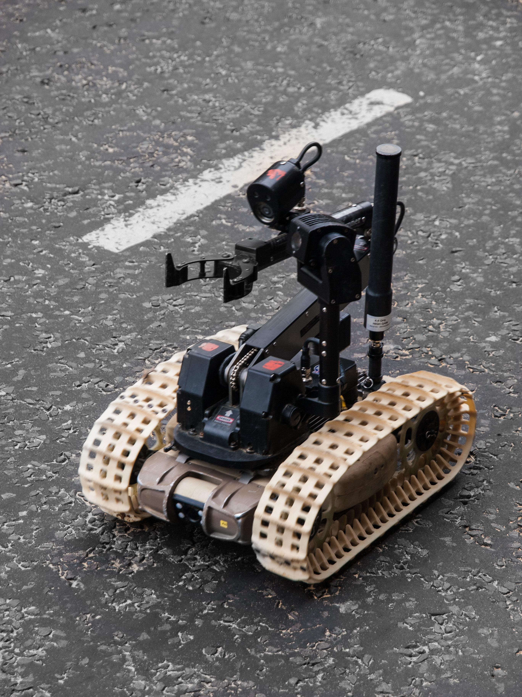

<!-- _class: title -->

Tropical Ruby 2026 Keynote

# Agile Vibe Coding
## IA substitui
## programador ruim.
## Não engenharia.

<!--
Tempo sugerido: ~0:45

- Eu quero abrir cravando a tese, porque o resto da palestra existe só pra sustentar isso.
- Sim, IA está substituindo gente em software.
- Mas não do jeito raso que o pânico de internet adora vender.
- O que ela pega primeiro é produtividade fake, senioridade fake e aquela engenharia porca que sobreviveu durante anos porque o mercado aceitava jogar dinheiro fora.
-->
---

<!-- _class: center tone-moss -->
# Fabio Akita

  
<strong style="display:block;font-size:1.3em;margin-bottom:6px;">Codeminer 42</strong>cofundador, hoje no conselho

  
<strong style="display:block;font-size:1.3em;margin-bottom:6px;">RubyConf Brasil</strong>fundador e organizador até 2016

  
<strong style="display:block;font-size:1.3em;margin-bottom:6px;">akitaonrails.com ✦</strong>20 anos em 5 de abril de 2026, 700+ artigos, agora em pt-BR e en

  
<strong style="display:block;font-size:1.3em;margin-bottom:6px;"><svg width="22" height="22" viewBox="0 0 24 24" fill="#c4302b" style="vertical-align:-4px;margin-right:6px;"><path d="M23.498 6.186a3.016 3.016 0 0 0-2.122-2.136C19.505 3.545 12 3.545 12 3.545s-7.505 0-9.377.505A3.017 3.017 0 0 0 .502 6.186C0 8.07 0 12 0 12s0 3.93.502 5.814a3.016 3.016 0 0 0 2.122 2.136c1.871.505 9.376.505 9.376.505s7.505 0 9.377-.505a3.015 3.015 0 0 0 2.122-2.136C24 15.93 24 12 24 12s0-3.93-.502-5.814zM9.546 15.568V8.432L15.818 12l-6.272 3.568z"/></svg>@akitando</strong>500 mil+ seguidores no YouTube

  
<strong style="display:block;font-size:1.3em;margin-bottom:6px;"><svg width="20" height="20" viewBox="0 0 24 24" fill="currentColor" style="vertical-align:-3px;margin-right:6px;"><path d="M18.244 2.25h3.308l-7.227 8.26 8.502 11.24H16.17l-5.214-6.817L4.99 21.75H1.68l7.73-8.835L1.254 2.25H8.08l4.713 6.231zm-1.161 17.52h1.833L7.084 4.126H5.117z"/></svg>@akitaonrails</strong>83,7 mil seguidores no X

  
<strong style="display:block;font-size:1.3em;margin-bottom:6px;">Flow + Inteligência Ltda</strong>alcance além da bolha tech

<!--
Tempo sugerido: ~0:50

- Pra quem só me conhece por um pedaço da internet: fui cofundador da Codeminer 42 e hoje estou no conselho.
- Fundei e organizei a RubyConf Brasil até 2016.
- Passei anos no YouTube com o Akitando, mais de 500 mil seguidores, e sigo ativo no X como @akitaonrails com cerca de 83,7 mil.
- E o akitaonrails.com completou 20 anos em 5 de abril de 2026, mais de 700 artigos publicados, agora em português e inglês.
- Também fui parar fora da bolha tech, em Flow e Inteligência Ltda.
-->
---

<!-- _class: statement -->

Arco Longo

# O pânico da IA caiu em cima de uma bolha velha.

Eu já vinha batendo na economia do programador fake antes de agentes de código prestarem pra alguma coisa.

<!--
Tempo sugerido: ~0:45

- Eu não comecei a falar disso quando IA virou moda.
- Eu já vinha batendo na bolha da programação, na economia do programador ruim, nas promessas de curso e bootcamp, muito antes de agente de código prestar pra alguma coisa.
- A IA não inventou essa fraqueza.
- Ela só escancarou mais rápido.
-->
---

<!-- _class: center -->

2019 → 2026

# Mesma tese. Ferramenta nova.

  
<strong>2019</strong>o inverno estava chegando

  
<strong>2020</strong>programação não é fácil

  
<strong>2022</strong>a bolha estourou

  
<strong>2025</strong>LLMs são loot boxes

  
<strong>2026</strong>agentes ficaram úteis

<!--
Tempo sugerido: ~0:50

- Tem uma linha reta aqui.
- Em 2019 eu já avisava que a bolha ia azedar.
- Em 2020 eu continuava repetindo que programação não é fácil.
- Em 2022 a bolha estourou de vez.
-->
---

<!-- _class: center -->

# A mentira antiga

## “vire engenheiro
## de software
## em 2 meses”

  
<strong>Fim de 2022</strong> layoffs vieram antes da IA saber programar direito

  
<strong>ChatGPT</strong> foi acelerador, não causa original

<!--
Tempo sugerido: ~0:55

- A mentira antiga era simples: faz um cursinho rápido, vira engenheiro de software, ganha salário alto e entra no modo easy.
- Isso sempre foi conversa mole.
- Bootcamp ensina ferramenta.
- Não comprime anos de julgamento de engenharia em poucos meses.
-->
---

<!-- _class: center -->

A Analogia

# Mesmo medo.

## “IA vai substituir artista.”  
## “IA vai substituir programador.”

<!--
Tempo sugerido: ~0:35

- Pra explicar o pânico atual, eu quero fazer uma tangente rápida com um universo que eu acompanho por hobby: drama de VTuber e drama de arte.
- O padrão emocional é o mesmo.
- No mundo da arte dizem que IA vai substituir artista.
- No nosso dizem que IA vai substituir programador.
-->
---

<!-- _class: center tone-ruby -->
# Caso AsamiArts

  

    

      <strong>Isso não é só drama de internet</strong> 
      tem mercado, comissão e renda real em volta disso
    

    
O ponto aqui não é fofoca. É processo falso vendido como habilidade real dentro de um mercado que vive de confiança.

  

  

    
  

<!--
Tempo sugerido: ~0:45

- O caso da AsamiArts me interessa não pela fofoca, mas pelo mecanismo.
- Isso não afeta só ego de artista no Twitter.
- Tem mercado real de comissão em volta disso.
- Quando processo falso entra, confiança sai.
-->
---

<!-- _class: center tone-ruby -->
# Tracing sem processo

<!-- pptx-video: asamiarts-tracing -->

  

    <ul>
      <li>não aparece construção bruta antes</li>
      <li>não aparece ida e volta de correção</li>
      <li>não aparece undo, hesitação, ajuste de proporção</li>
      <li>parece “mão firme”, mas parece firme demais</li>
    </ul>
    
No HTML e no PPTX com vídeo: reprodução automática em loop.

  

  

    <video
      src="../assets/asamiarts tracing.mp4"
      poster="../assets/asamiarts tracing.jpg"
      autoplay
      muted
      loop
      playsinline
      preload="auto"
      style="width:100%;border-radius:18px;box-shadow:0 18px 40px rgba(0,0,0,0.24);background:#000;"
    ></video>
  

<!--
Tempo sugerido: ~0:55

- Aqui é onde eu mostro o que um tracing falso tenta vender.
- Não tem sketch feio antes.
- Não tem correção de construção no meio.
- Sai limpo demais, reto demais, confiante demais.
-->
---

<!-- _class: center tone-ruby -->
# A camada escondida

<!-- pptx-video: tracing-hidden-layer -->

  

    <ul>
      <li>o vídeo não mostra o desenho “nascendo” de verdade</li>
      <li>minha leitura é que existe uma camada base escondida por trás</li>
      <li>o verde parece estar ali para sumir na edição</li>
      <li>sem a camada escondida, a mágica some</li>
    </ul>
    
Inferência a partir do vídeo: isso parece truque de gravação, não processo honesto.

  

  

    <video
      src="../assets/tracing, hidden layer vertical.mp4"
      poster="../assets/tracing, hidden layer vertical.jpg"
      autoplay
      muted
      loop
      playsinline
      preload="auto"
      style="height:430px;border-radius:18px;box-shadow:0 18px 40px rgba(0,0,0,0.24);background:#000;"
    ></video>
  

<!--
Tempo sugerido: ~0:55

- Esse é o pedaço mais importante.
- Minha leitura é que o vídeo esconde uma camada pronta por trás.
- O verde parece estar ali justamente para ser filtrado depois.
- O vídeo vende tracing; o truque está na composição.
-->
---

<!-- _class: center tone-ruby -->
# A evolução não bate

  

    
<strong>em pouco tempo muda demais</strong> traço, rosto, acabamento e construção saltam sem continuidade

    
Evolução humana existe, claro. O problema é quando a “mão” parece trocar de pessoa em intervalos curtos demais.

  

  

    
  

<!--
Tempo sugerido: ~0:50

- Outro sinal é a inconsistência.
- Não é só “melhorou”.
- A mão muda demais em pouco tempo.
- Parece mistura de fontes diferentes, não evolução orgânica.
-->
---

<!-- _class: center tone-ruby -->
# A alucinação entrega

  

    
<strong>o cano está do lado errado</strong> isso não é detalhe de estilo; é erro estrutural de entendimento

    
É o mesmo tipo de erro que a gente já conhece em IA: a imagem parece plausível à primeira vista, mas desmonta quando você olha a anatomia do objeto.

  

  

    
  

<!--
Tempo sugerido: ~0:45

- Aqui entra a alucinação mais óbvia.
- A arma parece arma até você olhar direito.
- O cano está do lado errado.
- Isso é erro de entendimento, não acabamento.
-->
---

<!-- _class: center tone-ruby -->
# LoRA é estilo empacotado

  

    <ul>
      <li>LoRA é um ajuste leve em cima de um modelo base</li>
      <li>ele empurra o modelo para um traço, tema ou artista específico</li>
      <li>a comunidade treinou muita LoRA com imagem pública e zero autorização</li>
      <li>depois isso volta disfarçado de “meu estilo”</li>
    </ul>
  

  

    
  

<!--
Tempo sugerido: ~0:55

- E tem outra camada aí: LoRA.
- LoRA é um ajuste leve em cima de um modelo base para puxar um traço específico.
- O problema é que muita LoRA foi treinada com arte pública sem autorização.
- Aí o roubo de estilo volta embalado como ferramenta.
-->
---

<!-- _class: statement -->

Mesma Regra No Código

Fonte: https://commons.wikimedia.org/wiki/File:Part_of_my_messy_desk_(430672681).jpg

# IA reflete quem você é

## Ele te acelera: se você for bom, fica ainda melhor. Se você for ruim, vai ficar ainda pior.

<!--
Tempo sugerido: ~1:00

- IA não cria competência do nada.
- Ela amplifica o que você já é.
- Bom engenheiro: produz mais, mais rápido.
- Mau engenheiro: produz lixo mais rápido.
-->
---

<!-- _class: center tone-ruby -->

31 de março de 2026

# Claude Code vazou

  
<strong>512 mil</strong>linhas de TypeScript

  
<strong>1.900</strong>arquivos

  
<strong>59,8 MB</strong>de mapa do código exposto

  
<strong>6,5/10</strong>o “espaguete de sênior”

<!--
Tempo sugerido: ~0:45

- Daí veio uma das confirmações mais engraçadas possíveis dessa tese: o vazamento do Claude Code em 31 de março de 2026.
- A CLI oficial da Anthropic deixou escapar um mapa enorme do código e, de repente, todo mundo pôde olhar as tripas de uma das ferramentas de agente mais importantes do mercado.
-->
---

<!-- _class: center -->

A Faísca

# A lição não foi "uau, magia"

  

    
<strong>Nem a Anthropic escapa</strong> pressão de entrega também gera código tático

    
<strong>E copiaram rápido</strong> free-code e reimplementações apareceram quase na hora

  

  

    
  

<!--
Tempo sugerido: ~1:00

- Abriram o código. O que apareceu? Não foi magia.
- Foi espaguete de sênior: base grande, pressionada por entrega, cheia de remendo.
- E quase imediatamente começaram a reimplementar. Quando a mística some, sobra engenharia.
-->
---

<!-- _class: center tone-sand -->
# LLMs são loot boxes

  
<strong>Probabilísticas</strong>
nunca 100% confiáveis

  
<strong>Dependem de contexto</strong>
qualidade depende do que você dá e do que você checa

  
<strong>Gastam loop</strong>
o ecossistema inteiro te incentiva a gastar mais tokens

<!--
Tempo sugerido: ~0:55

- Eu chamei LLMs de loot boxes porque elas são probabilísticas.
- Não são compiladores determinísticos.
- Não existe garantia de correção.
- Dá pra melhorar bastante as chances com contexto, ferramenta, ciclo de avaliação e prompt melhor? Dá.
-->
---

<!-- _class: center tone-sand -->

2026 Ainda

Fonte: https://commons.wikimedia.org/wiki/File:Robot_(7127639975).jpg

# Modelo ainda bajula e erra

  
<strong>Bajula você</strong>
muitas vezes responde o que você quer ouvir

  
<strong>Erra confiante</strong>
inventa detalhe e segue como se estivesse certo

  
<strong>Precisa de freio</strong>
execução, teste e revisão continuam obrigatórios

<!--
Tempo sugerido: ~0:45

- E eu quero deixar uma coisa bem explícita: o modelo de 2026 ainda baixa a cabeça pra você.
- Se você vier com premissa torta, ele muitas vezes prefere te agradar em vez de te contrariar.
- Ele também continua errando com confiança.
- Inventa detalhe, completa lacuna do jeito errado, segue em frente como se estivesse tudo certo.
-->
---

<!-- _class: center tone-moss -->

Linha Do Tempo

# 2025 foi o ano dos Agentes

  
<strong>mar 2025</strong>Responses API, tools e Agents SDK viram produto

  
<strong>mai 2025</strong>Claude 4 pensa entre tool calls e Claude Code vira GA

  
<strong>ago 2025</strong>GPT-5 aguenta loop mais longo e erra menos no uso de ferramenta

  
<strong>nov 2025</strong>GPT-5.1 e Opus 4.5 refinam uso diário

Não foi um dia mágico. Foi o ano inteiro fechando modelo, thinking, tool support e operação.

<!--
Tempo sugerido: ~0:55

- Pra mim, 2025 foi o ano em que a pilha foi fechando.
- Em março, tool support virou plataforma de verdade.
- Em maio, a Anthropic já estava falando de thinking com tool use e colocando Claude Code em circulação séria.
- Em agosto e novembro, os modelos de fronteira ficaram mais estáveis nesse loop.
-->
---

<!-- _class: center tone-moss -->

Convergência

# Dezembro de 2025 foi a Virada

  
<strong>OpenAI — 13 nov</strong> GPT-5.1 sai pra desenvolvedores e o Codex CLI finalmente fica bom o bastante pra rodar tarefa longa de verdade no terminal

  
<strong>Anthropic — 24 nov</strong> Claude Opus 4.5 sai e o Claude Code amadurece com thinking entre tool calls, execução em background e fluxo de agente sério

Modelo novo + CLI de agente madura, os dois ao mesmo tempo. Em dezembro deu pra apostar tempo de verdade. Em janeiro de 2026 eu entrei nessa também — foi daí que saiu a maratona.

<!--
Tempo sugerido: ~1:00

- Não foi só sair modelo novo. Foi modelo + CLI de agente alinhando ao mesmo tempo.
- 13 de novembro: GPT-5.1 sai e o Codex CLI fica bom o bastante pra tarefa longa de verdade.
- 24 de novembro: Opus 4.5 sai e o Claude Code amadurece com thinking entre tool calls.
- Dezembro: deu pra começar a usar isso pra trabalho real. Janeiro de 2026: eu entrei.
-->
---

<!-- _class: center -->

# Fevereiro e março de 2026

## eu parei de falar  
## e fui maratonar

Fonte: https://commons.wikimedia.org/wiki/File:Mount_Everest_as_seen_from_Drukair2_PLW_edit.jpg

<!--
Tempo sugerido: ~0:25

- Então eu parei de opinar e fui testar com pele em jogo.
- Não com prompt de brinquedo.
- Não com videozinho fake de SaaS em dez minutos.
- Projeto real.
-->
---

<!-- _class: center tone-sand -->

Painel de Projetos

# Do zero pra software real

  
  
  
  
  
  
  
  

<!--
Tempo sugerido: ~0:35

- Este slide é só a parede de projetos.
- FrankMD, FrankMega, Frank Sherlock, Frank Yomik, Frank FBI, Frank Karaoke e outros.
- O objetivo não é explicar repositório por repositório.
- O objetivo é mostrar volume e variedade: desktop, Rails, Rust, Flutter, ferramentas, mídia, deploy, software em uso real.
-->
---

<!-- _class: center tone-sand -->

A Prova Prática

# Mesmo dev. Mesmo agente. Processo diferente.

  
<strong>FrankMD</strong> 212 commits em 19 dias, refactor pesado, teste correndo atrás

  
<strong>M.Akita Chronicles</strong> 274 commits em 8 dias, TDD, CI e refatoração contínua

A variável não foi “IA melhor”. Foi disciplina de engenharia desde o primeiro commit.

<!--
Tempo sugerido: ~0:55

- Aqui entra a comparação que eu acho mais forte de todas.
- FrankMD de um lado.
- M.Akita Chronicles do outro.
- Mesmo desenvolvedor.
- Aqui deixa de ser opinião e vira evidência.
-->
---

<!-- _class: center tone-sand -->

No Conjunto Completo Dos Projetos Citados

# Números que pesam

  
<strong>221.932</strong>linhas de código

  
<strong>92.017</strong>linhas de teste

  
<strong>1.612</strong>commits

  
<strong>~297 h</strong>horas ativas estimadas

Agregado do recorte citado no começo, agora incluindo também `akitando-news` e `frank_karaoke`: `frank*`, `FrankMD`, `mila-bot`, `easy-*`, `ai-jail`, `akitando-news` e `frank_karaoke` (Flutter/Android). Contagem em arquivos rastreados no git, somando só linhas de código do `tokei`, separando teste por path e excluindo docs, fixtures, snapshots e árvores importadas de terceiros.

<!--
Tempo sugerido: ~1:05

- E aqui é onde eu boto peso na afirmação de velocidade.
- Recontando do zero com `tokei`, em arquivos rastreados no git, o conjunto completo citado no começo, agora com `akitando-news` e `frank_karaoke`, dá 221.932 linhas de código, 92.017 linhas de teste, 1.612 commits e cerca de 297 horas ativas estimadas.
- E essa conta está fechada com o mesmo critério dos dois lados: só linha de código, separando produção de teste pelo path, e excluindo documentação, fixtures, snapshots, virtualenvs, node_modules e árvore importada de terceiros.
- Então não tem README, arquivo auxiliar ou biblioteca de terceiro inflando número.
- Com isso na mesa, agora dá pra discutir mecanismo, não fé.
-->
---

<!-- _class: center tone-sand -->

Fonte: https://commons.wikimedia.org/wiki/File:Brad_Kahlefeldt_and_Ned_Mortimer_running_in_the_50m_running_sprint.jpg

# Alcançamos "Developer 10x"?

  
<strong>5x a 10x</strong>de velocidade

  
<strong>Mais tração</strong>menos bloqueio, menos procrastinação

  
<strong>Mais alcance</strong>stack inteira, ferramentas, deploy, documentação

  
<strong>Mais confiança</strong>testes, integração contínua, refatoração, produção

<!--
Tempo sugerido: ~1:00

- Da minha experiência prática, o resumo honesto é 5x a 10x de velocidade.
- Não porque o modelo escreve código perfeito.
- Não escreve.
- O ganho vem porque ele atravessa aquele atrito chato que normalmente quebra foco: código repetitivo, busca, refatoração repetitiva, teste repetitivo, execução de comando, tentativa rápida.
-->
---

<!-- _class: statement tone-moss -->

Ciclo do Agente

Fonte: https://commons.wikimedia.org/wiki/File:F-35A_flight_(cropped).jpg

  

    <h1 style="margin:0;line-height:1.05;">Planeja. Investiga. Lapida. Opera. Testa. Ajusta.</h1>
  

  

    
<strong>Shell e editor</strong>
o modelo parou de só sugerir e passou a operar

    
<strong>Teste e execução</strong>
erro voltou como feedback em segundos

    
<strong>Busca e contexto</strong>
documentação e código viraram parte do loop

  

<!--
Tempo sugerido: ~1:00

- O pulo do gato não foi QI mágico, foi ferramenta entrando no loop.
- Shell, editor, execução, teste, busca, contexto — tudo isso virou parte do ciclo do agente.
- Acróstico PILOTA: planeja, investiga, lapida, opera, testa, ajusta.
- Não tem nada de místico. É compressão de retorno de engenharia.
-->
---

<!-- _class: center tone-sand -->

Normalizando o Ritmo

# 45 dias de maratona não são 45 dias normais

  
<strong>45 dias corridos</strong>quase 16h por dia, 7 dias por semana

  
<strong>~126 dias corridos</strong>algo perto de 4 meses e 1 semana

  
<strong>~630 a 1.260 dias corridos</strong>o mesmo sênior sem IA

  
<strong>~21 a 42 meses</strong>ou cerca de 1,8 a 3,5 anos

Estimativa linear em calendário real de trabalho: 8h por dia, só em dias úteis.

<!--
Tempo sugerido: ~0:55

- Aqui eu preciso fazer a conta honesta, senão parece truque de palco.
- Isso foi entregue em 45 dias corridos, sim.
- Mas em ritmo de maratona: quase 16 horas por dia, 7 dias por semana.
- Se você converte isso para um sênior trabalhando num ritmo sustentável, no máximo 8 horas por dia e só em dias úteis, essa mesma entrega com IA vira algo como 126 dias corridos, perto de 4 meses e 1 semana.
-->
---

<!-- _class: center tone-moss -->
# Prompt único é pra demo

  
<strong>Produção é iteração</strong> bug, deploy, retorno, refatoração, ajuste de prompt

  
<strong>“Pronto” é mentira</strong> 125 commits de pós-produção em 4 projetos

<!--
Tempo sugerido: ~0:55

- A fantasia do prompt único é preguiçosa.
- Ela parte da ideia de que dá pra prever e especificar tudo antes.
- Software real não funciona assim.
- Produção revela coisa que você nem sabia que importava.
-->
---

<!-- _class: center -->

Akita Antigo Continua Certo

# Fundamento primeiro

  
  
  
  

<!--
Tempo sugerido: ~0:50

- É por isso que o Akita antigo continua valendo.
- Não terceirize sua decisão.
- Aprenda a aprender.
- Entenda que programação não é fácil.
-->
---

<!-- _class: center -->

# Não terceirize seu julgamento

## nem pra guru  
## nem pra bootcamp  
## nem pro modelo

A lógica continua a mesma: experimento pequeno, feedback rápido, correção contínua.

<!--
Tempo sugerido: ~0:45

- O mais difícil de ensinar pra iniciante é isso: julgamento não é uma coisa que você baixa pronta.
- Não vem de influencer, não vem de bootcamp, não vem de modelo.
- O modelo mental continua o mesmo: experimento pequeno na beira do caos, erro cedo, retorno rápido, correção contínua.
-->
---

<!-- _class: center tone-moss -->

Nome Verdadeiro

# Agile Vibe Coding

## é XP com pareamento de máquina

  
<strong>TDD</strong>
segura erro de modelo antes de virar lama

  
<strong>CI por commit</strong>
pega drift e regressão cedo

  
<strong>Refatoração contínua</strong>
evita cirurgia cara depois

<!--
Tempo sugerido: ~1:00

- Agile Vibe Coding é XP com pareamento de máquina. A estrutura por baixo é velha.
- TDD não é perfumaria. Segura erro de modelo antes de virar lama.
- CI por commit pega drift e regressão cedo.
- Refatoração contínua evita cirurgia cara depois.
-->
---

<!-- _class: center tone-moss -->

Fonte: https://commons.wikimedia.org/wiki/File:Pair_Programming.jpg

# O pareamento mudou

  
<strong>Eu trago</strong> direção, julgamento, contexto, gosto

  
<strong>O agente traz</strong> velocidade de execução, busca, fôlego operacional

IA é espelho: sênior bom ganha alavancagem, programador ruim ganha velocidade pra errar.

<!--
Tempo sugerido: ~1:00

- O melhor corte de responsabilidade que eu encontrei foi esse: eu trago direção, julgamento, contexto e gosto.
- O agente traz velocidade de execução, busca e fôlego operacional.
- Se eu reduzo o agente a digitador burro, piora.
- Se eu entrego produto e arquitetura pra ele sozinho, piora também.
-->
---

<!-- _class: center tone-moss -->

Estado dos Modelos, abril de 2026

# Modelos fechados ainda lideram

  
<strong>Anthropic</strong>
continua no topo pra agentes de código

  
<strong>OpenAI</strong>
GPT 5.4 virou modelo forte pra código e agentes

  
<strong>GLM 5.1 (Z.AI)</strong>
único concorrente real fora de Anthropic e OpenAI

MiniMax, Kimi e o resto ainda correm atrás. Open source tem utilidade, mas não empatou no fluxo completo com agentes.

<!--
Tempo sugerido: ~0:55

- No ecossistema de modelos em abril de 2026, minha leitura prática é simples.
- Anthropic e OpenAI continuam sendo as plataformas de ponta que mais importam pra código sério.
- Fora desses dois, o único concorrente que realmente entregou no meu benchmark foi o GLM 5.1 da Z.AI.
- MiniMax, Kimi e o resto ainda correm atrás. Open source tem utilidade, mas não empatou no fluxo completo com agentes.
-->
---

<!-- _class: center tone-moss -->

Benchmark Próprio — 22 Modelos, Código Real

# Quem consegue bater o Claude Opus?

  

    
<strong>Só 4 geram código que roda</strong> Claude Sonnet 4.6, Opus 4.6, GPT 5.4 e GLM 5 / 5.1 (da Z.AI, ~89% mais barato que Opus)

    
<strong>O resto inventou APIs</strong> Kimi, DeepSeek, MiniMax, Qwen — alucinaram gems e endpoints que não existem

    
<strong>Thinking separa os dois grupos</strong> budget extra de inferência pra planejar tool calls antes de agir — sem isso, o modelo chuta

  

  

    
  

Artigo completo: akitaonrails.com/2026/04/05/testando-llms-open-source-e-comerciais-quem-consegue-bater-o-claude-opus

<!--
Tempo sugerido: ~1:00

- Pra não ficar só na opinião, montei um benchmark automatizado com 22 modelos.
- Testei modelos open source locais (RTX 5090 + servidor AMD 128 GB) e comerciais via API, todos nas mesmas condições.
- Resultado: só 4 modelos geraram código que funciona de verdade.
- Claude Sonnet e Opus, GPT 5.4 e GLM 5 / 5.1 (GLM 5 se você quer billing centralizado no OpenRouter, GLM 5.1 direto na Z.AI).
- O resto — Kimi, DeepSeek, MiniMax, Qwen — inventou APIs que não existem.
- GLM 5 é 89% mais barato que Opus e foi a única alternativa fora Anthropic/OpenAI que rodou.
- E por que os modelos de ponta ganham? Thinking. Não é mágica — é budget extra de inferência pra planejar qual ferramenta usar, em que ordem, com quais argumentos, antes de agir. Sem isso, o modelo chuta.
- Artigo completo no blog, link no slide.
-->
---

<!-- _class: center tone-moss -->

Por Que Tão Poucos Funcionam

# Não é mais só parâmetros

  
<strong>Prompt Caching</strong>
sem cache de KV, cada turno relê o contexto inteiro e o custo explode no loop do agente

  
<strong>Tool Calling</strong>
o modelo precisa decidir qual ferramenta chamar, com quais argumentos, e tratar o resultado de volta

  
<strong>Reasoning / Thinking</strong>
budget extra de inferência pra planejar antes de agir, em vez de chutar a primeira coisa

Tamanho de modelo virou commodity. As três condições acima é que separam quem aguenta um agente real — DeepSeek, por exemplo, falha hoje justamente por não fechar essas três.

<!--
Tempo sugerido: ~0:55

- Por que só 4 modelos passam no benchmark? Não é tamanho de modelo. Tamanho virou commodity.
- Prompt caching: sem KV cache, cada turno relê tudo e o custo do loop do agente explode.
- Tool calling: o modelo precisa escolher a ferramenta, montar argumento e tratar resultado de volta.
- Reasoning / thinking: budget extra de inferência pra planejar antes de agir.
- Sem essas três condições casadas, não tem agente que funcione na prática.
-->
---

<!-- _class: center tone-moss -->

Surpresa Da Família Qwen

Fonte: https://commons.wikimedia.org/wiki/File:Ancient_Chinese_Writing_on_Warring_States_Bamboo_Slips_1.jpg

# "Coder" no nome não vira coder melhor

  

    
<strong style="font-size:1.1em;">Qwen 3 Coder 30B</strong>
devolveu string mockada hardcoded em vez de chamar a API

    
<strong style="font-size:1.1em;">Qwen 2.5 Coder 32B</strong>
90 minutos de timeout, zero arquivos escritos

  

  

    
<strong style="font-size:1.1em;">Qwen 3.5 27B distilado do Claude 4.6</strong>
"Claude em casa" rodou Rails mas alucinou a API toda

    
<strong style="font-size:1.1em;">Qwen 3.5 35B-A3B (MoE geral) ✓</strong>
único que vale a tentativa: rodou Rails e alucinações somem em 1-2 follow-ups — ainda assim atrás de Claude, GPT 5.4 e GLM 5.1

  

<!--
Tempo sugerido: ~0:50

- Outra surpresa do benchmark: a intuição de que modelo com "Coder" no nome é melhor pra programação não bateu.
- Dos três Qwen Coder dedicados, dois falharam catastroficamente e um nem rodou direito.
- As versões gerais do Qwen bateram as Coder dedicadas. Fine-tuning específico pra código não substituiu fluxo completo de agente.
- Até a distilação do Claude no Qwen 3.5 27B prometia "Claude em casa" e entregou alucinação de API.
- Se alguém insistir em testar Qwen pra código, só o 3.5 35B-A3B geral (MoE) vale a pena — e mesmo assim fica bem atrás dos modelos de ponta.
- Conclusão: marketing label não substitui as três condições do slide anterior.
-->
---

<!-- _class: center tone-moss -->

Aceitando A Imperfeição

Fonte: https://commons.wikimedia.org/wiki/File:Kintsugi.jpg

# IA nunca vai ser perfeita.

## Mas errar ficou barato.

  
<strong>claw-code: clean-room em 24h</strong>
clone do Claude Code reimplementado do zero logo depois do leak

  
<strong>free-code: fork sem amarras</strong>
telemetria e travas arrancadas quase na hora

  
<strong>OpenClaw + memclaw</strong>
base madura, já com memclaw plugado — sistema de memória inspirado no do Claude

<strong>Barato:</strong> CRUD, landing page, painel interno, bot, ETL, cola entre APIs. &nbsp;|&nbsp; <strong>Caro continua o que sempre foi:</strong> julgamento, arquitetura, operação, dono do problema.

<!--
Tempo sugerido: ~1:00

- LLM nunca vai ser determinística. Vai continuar errando, alucinando, baixando a cabeça pro usuário.
- Mas o ciclo de feedback ficou tão curto que errar deixou de ser caro.
- Loop de agente roda, quebra, recebe stack trace, conserta, tenta de novo — em segundos.
- E quando algo fica imperfeito mas barato, o open source corre por cima: claw-code apareceu como clone clean-room do Claude Code em 24h, free-code apareceu sem telemetria, e o OpenClaw já tinha base madura — agora com memclaw plugado, que é um sistema de memória inspirado no do próprio Claude.
- O que ficou barato é software trivial: CRUD, landing, bot, ETL. O que continua caro é o que sempre foi: julgamento, arquitetura, operação, dono do problema.
-->
---

<!-- _class: center tone-sand -->

Assinatura Vs Token

# Assinatura ganha de pay-as-you-go

  

    
<strong>GPT 5.4 Pro na API</strong>
~US$ 990/mês pagando por token no OpenRouter

    
<strong>ChatGPT Pro</strong>
US$ 200/mês ilimitado — 5x mais barato que a API

    
<strong>Claude Opus na API</strong>
~US$ 450/mês pagando Opus por token

    
<strong>Claude Max 20x</strong>
US$ 200/mês, ~220K tokens a cada 5h — metade do preço

  

  

    
  

Estimativa pra uso moderado de coding (~15M input + ~3M output tokens/mês).

<!--
Tempo sugerido: ~0:55

- Pay-as-you-go via API parece mais "honesto", mas sai caro rapidíssimo pra quem usa pesado.
- GPT 5.4 Pro na API bate ~US$ 990/mês num uso moderado; ChatGPT Pro a US$ 200/mês ilimitado é 5x mais barato.
- Claude Opus na API chega perto de US$ 450/mês; Claude Max 20x a US$ 200/mês cobre uso pesado pela metade.
- O recado: se você usa coding agent sério no dia a dia, assinatura é muito mais cost-effective.
- Talvez subsidiado demais. Talvez não pare em pé pra sempre. Mas hoje, é assim.
-->
---

<!-- _class: center tone-sand -->

Economia da IA

# Treino e inferência disputam a mesma tomada

  
<strong>US$ 500 bi</strong>
investimento global em data centers em 2024

  
<strong>415 → 945 TWh</strong>
consumo elétrico dos data centers de 2024 até 2030

  
<strong>20%</strong>
dos projetos podem atrasar por gargalo de rede

  
<strong>2,5 bi/ano</strong>
ritmo anual do Claude Code, com uso semanal dobrando desde 1 jan 2026

Meu palpite: com energia, margem e demanda apertando, eu esperaria menos milagre de treino e mais briga por eficiência, suporte a ferramentas e inferência.

<!--
Tempo sugerido: ~0:55

- Aqui entra minha especulação.
- A conta física começou a apertar.
- Data center consome mais energia, investimento explodiu e já tem projeto atrasando por gargalo de rede.
- Ao mesmo tempo, agente bom gasta mais inferência por usuário do que chatbot bobo.
- Então eu não espero salto de ordem de grandeza tão cedo.
- Eu espero mais trabalho em eficiência, serving, tool support e produto.
- E se a Anthropic vier mesmo para IPO este ano, a pressão por margem e previsibilidade aumenta mais ainda.
-->
---

<!-- _class: center tone-ruby -->

A Correção

Fonte: https://commons.wikimedia.org/wiki/File:Employee_Packing_Things_Into_Box.jpg

# Programador ruim vai sair

## e isso melhora a indústria

E a correção continua agora. Em 1 de abril de 2026, a Oracle entrou em mais uma rodada grande de layoffs.

<!--
Tempo sugerido: ~0:45

- Aqui é a parte em que eu paro de fingir diplomacia.
- Eu estou genuinamente feliz que a bolha do programador ruim esteja morrendo.
- A indústria passou anos trocando engenharia por competência fake e dívida técnica.
- A correção continua: Oracle reportou mais uma onda pesada de layoffs em 1 de abril de 2026.
-->
---

<!-- _class: center tone-moss -->

Fonte: https://commons.wikimedia.org/wiki/File:Vernon_Rieta_teaching_Kung_Fu.jpg

# Júnior herda. Sênior ensina.

  

    
<strong>Júnior vai herdar a sujeira</strong>
startup cheia de lixo de IA vai precisar de limpeza

    
<strong>Vai aprender no caos</strong>
igual gerações anteriores aprenderam

    
<strong>Ainda precisa de sênior</strong>
agente nenhum ensina julgamento

  

  

    
<strong>Sênior não é imortal</strong>
muda de empresa, cansa, se aposenta

    
<strong>Nova obrigação</strong>
ensinar engenharia com IA antes do código apodrecer

    
<strong>Sem isso a organização apodrece</strong>
não basta usar IA bem, tem que formar substituto

  

<!--
Tempo sugerido: ~1:10

- Júnior não morreu, só mudou de forma. Vai herdar a sujeira da era do vibe coding sem freio.
- Aprender no projeto bagunçado é como gerações anteriores aprenderam. Não é tragédia, é cicatriz.
- Mas isso só para em pé se sênior fizer o trabalho dele: ensinar engenharia com IA antes do código apodrecer.
- Sênior não é imortal. Se não formar substituto, a organização apodrece.
-->
---

<!-- _class: end -->

Conclusão

Fonte: https://commons.wikimedia.org/wiki/File:Mountain_Climber_In_Mountains_(Unsplash).jpg

# Vai sobreviver quem souber fazer engenharia.

## IA não transforma coder ruim em engenheiro.
## Fundamento. Disciplina. Iteração. Gosto.

<!--
Tempo sugerido: ~1:00

- Parte dura: IA não transforma programador ruim em engenheiro. Ajuda a fazer estrago maior mais rápido.
- E ajuda engenheiro de verdade a atravessar o caos mais rápido, sem deixar o software morrer.
- Então eu fecho assim: vai sobreviver quem tem fundamento, disciplina, iteração e gosto.
- Se você tem isso, IA vira multiplicador. Se não tem, IA é só uma forma mais rápida de ser exposto.
-->
---

<!-- _class: center tone-extra -->

Merchan Sem Vergonha

  

    <h1 style="margin:0 0 18px 0;line-height:0.95;">Assine The M.Akita Chronicles</h1>
    
themakitachronicles.com

    
Se você curtiu essa palestra, vai lá assinar. Toda semana tem bastidor real, código real e projeto real em produção.

  

  

    
  

<!--
Tempo sugerido: ~0:20

- E já que é pra acabar sem falsa modéstia: se você curtiu essa palestra, assina o The M.Akita Chronicles.
- Está tudo aí na tela.
- É onde eu continuo publicando bastidor real, projeto real, código real e o que deu certo ou errado em produção.
- Quer acompanhar essa linha de raciocínio semana a semana? Vai em themakitachronicles.com e assina.
-->
---

<!-- _class: center tone-extra -->

Bastidor

# Sim, este deck inteiro foi feito com IA

  
<strong>Pesquisa e estrutura</strong>
fontes, ordem dos argumentos, cortes e rearranjos

  
<strong>Texto sincronizado</strong>
slides, roteiro e presenter notes mantidos juntos

  
<strong>Mídia e acabamento</strong>
frames, crops, vídeos, builds e pós-processo do PPTX

Agente no terminal, Marp para gerar o deck, scripts para embutir vídeo no PPTX e iteração curta até o resultado fechar.

<!--
Tempo sugerido: ~0:30

- E sim, já que o tema da palestra pede isso, este deck inteiro também foi feito com IA.
- Pesquisa, estrutura, roteiro, notas, crops, builds e automação saíram do mesmo fluxo.
- Agente no terminal, Marp para o deck e script para pós-processar o PPTX com vídeo.
- Não é discurso abstrato. Eu usei isso pra fazer a própria palestra.
-->
---

<!-- _class: center end tone-extra-dark -->

Fonte: https://commons.wikimedia.org/wiki/File:Standing_Ovation_(21835796).jpg

  <h1 style="font-size:3.9em;line-height:0.9;margin:90px 0 70px 0;letter-spacing:0.02em;">OBRIGADO</h1>
  

    

      codeminer42.com
      themakitachronicles.com
      github.com/akitaonrails/tropicalruby-2026
    

  

<!--
Tempo sugerido: ~0:10

- Obrigado.
- Os links estão aí embaixo.
-->
